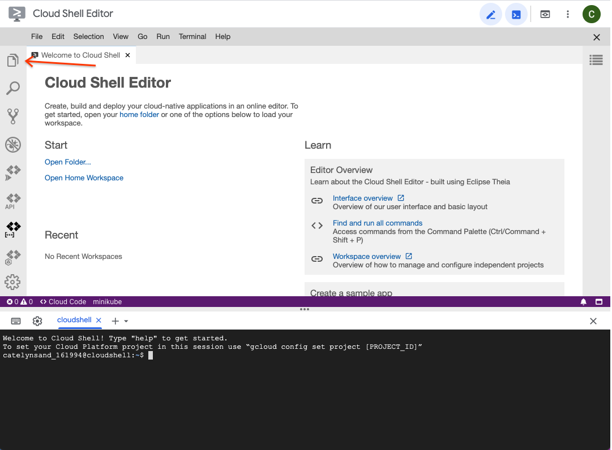

# Using Cloud Shell with Python


## Overview


In this codelab, you'll setup  [Google Cloud Shell](https://cloud.google.com/shell) for developing Python applications. Cloud Shell provides a  [Debian Linux command-line environment](https://cloud.google.com/shell/docs/how-cloud-shell-works) as well as an online code editor.

### What you'll need

* Google account
* Web browser (Google Chrome recommended)

### What you'll learn

* Run Cloud Shell
* Create a Python virtual environment
* Edit files with Cloud Shell Editor
* Install Python packages to a virtual environment


## Open Cloud Shell


1. Navigate to the Google Cloud Console:  [https://console.cloud.google.com/](https://console.cloud.google.com/)

Accept any terms of service that appear.
2. Click the Cloud Shell icon on the top of the screen.   
3. Click the Continue button if it appears to activate Cloud Shell. 


## Create a Python 3 virtual environment


To isolate our Python environment from the system Python, create a virtual environment.

1. Create a directory to hold virtual environment files. Paste this command into the Cloud Shell and press Enter to execute it.

```
mkdir ~/venvs
```

2. Create a virtual environment called "dev".

```
python3 -m venv venvs/dev
```

3. Edit the .bashrc file so that our virtual environment is used by default when you open Cloud Shell.

```
echo '
source "$HOME/venvs/dev/bin/activate"
' >> "$HOME/.bashrc"
```

The "echo" command prints text, and the ">>" command appends that text to the file.

4. Activate your virtual environment by loading the configuration you just created.

```
source .bashrc
```

Now when you open Cloud Shell, you should see "(dev)", which indicates you are using the virtual environment you just created.

5. Verify the Python binary is the one from the virtual environment by using the "which" command.

```
which python
```


If you have successfully activated the virtual environment, you should see an output like "/home/USERNAME/venvs/dev/bin/python".


## Open Cloud Shell Editor


In addition to a command-line interface, Cloud Shell provides a graphical code editor.

1. Click the square button   to open Cloud Shell in a new window.  
2. In the new window click the pencil button   to open the code editor. 


## Open a working directory


In order to edit files, Cloud Shell Editor needs a working directory. Opening a working directory allows you to browse any files contained within it and provides a starting directory for any command-line terminals started by the editor.

1. Click the files button   to open the files pane.

2. Click the "Open Folder" button to select a folder.

3. Usually, a you would select a sub-directory corresponding to the project you're working on. Today, select the folder corresponding to your username. This is your "home" directory. Any files created here or in sub-directories are persisted across Cloud Shell sessions.


4. Click the "Open" button once you have selected the directory. You should now see a listing of files in the editor.


## Create a requirements.txt file


Use Cloud Shell Editor to create a text file containing a list of Python packages you'll use in this course.

1. Select File -> New File from the menu.

2. Enter "requirements.txt" as the file name.


3. Click the OK button to create the file.
4. Select the file to open it.

5. Paste in the list Python packages you'll be using in this course.

```
appdirs==1.4.4
astroid==2.5.6
attrs==20.3.0
black==21.4b2
cfgv==3.2.0
click==7.1.2
coverage==5.5
distlib==0.3.1
filelock==3.0.12
flake8==3.9.1
Flask==1.1.2
identify==2.2.4
importlib-metadata==4.0.1
iniconfig==1.1.1
isort==5.8.0
itsdangerous==1.1.0
Jinja2==2.11.3
lazy-object-proxy==1.6.0
MarkupSafe==1.1.1
mccabe==0.6.1
mypy-extensions==0.4.3
nodeenv==1.6.0
packaging==20.9
pathspec==0.8.1
pluggy==0.13.1
pre-commit==2.12.1
py==1.10.0
pycodestyle==2.7.0
pyfakefs==4.4.0
pyflakes==2.3.1
pylint==2.8.2
pyparsing==2.4.7
pytest==6.2.3
pytest-cov==2.11.1
PyYAML==5.4.1
regex==2021.4.4
six==1.16.0
toml==0.10.2
typed-ast==1.4.3
typing-extensions==3.10.0.0
virtualenv==20.4.5
Werkzeug==1.0.1
zipp==3.4.1
```

6. Save the file.


## Open Cloud Shell Editor Terminal


In addition to the Cloud Shell command-line, the Cloud Shell Editor comes with a command-line terminal. Using this terminal ensures that you are in the correct directory. It also enables useful features such as links to source code files from test output, which we will see in a later codelab.

1. Open a command-line terminal from Cloud Shell Editor by clicking the Terminal -> New Terminal menu button.


You should see a terminal pane at the bottom of your window.

2. Verify the Python binary is the one from the virtual environment by using the "which" command.

```
which python
```

If you have successfully activated the virtual environment, you should see an output like "/home/USERNAME/venvs/dev/bin/python".

3. Run the "ls" command to list the files in the current directory.

```
ls
```


Verify that the "requirements.txt" file appears in the list.


## Install Python packages


Finally, add the Python packages that you'll use in this course to the virtual environment.

1. Install the packages from the "requirements.txt" file into your virtual environment by running the "pip" command.

```
pip install -r requirements.txt
```

2. From the command-line verify that the packages were installed successfully. Use the "-c" option for Python to run a short one-line program to verify that Flask was installed.

```
python -c 'import flask; print(flask.__version__)'
```


You should see "1.1.2" printed to the command-line output.


