# Using Git with Cloud Shell


## Overview


In this codelab, you'll use Cloud Shell to clone and modify a git repository, hosted on a private GitLab instance.

### Prerequisites

* Using Cloud Shell and Cloud Shell Editor ( [codelab](https://google-techx.github.io/software-development-studio/01a-cloud-shell/index.html#0))

### What you'll need

* Google account
* GitLab account
* Web browser (Google Chrome recommended)

### What you'll learn

* Clone a repository hosted on GitLab
* Make changes to a code repository
* Create a merge request in GitLab
* Resolve conflicts when there are multiple changes to the same file


## Open Cloud Shell


Open the Cloud Shell command-line.

1. Navigate to the Google Cloud Console:  [https://console.cloud.google.com/](https://console.cloud.google.com/)
2. Click the Cloud Shell button   at the top of the screen.
3. Click the square button   to open Cloud Shell in a new window. 


## Configure git


Git is pre-installed on Google Cloud Shell, but it needs to be configured.

1. Set your name and email, which will appear in git version history.

```
git config --global user.name "Your Name"
git config --global user.email "yourname@google.com"
```

2. To authenticate with GitLab from Cloud Shell, create an  [SSH key pair](https://techx-gitlab.640k.net/help/ssh/README#generating-a-new-ssh-key-pair).

In the Cloud Shell command-line, run the ssh-keygen command to create a private/public key pair.

```
ssh-keygen -t ed25519 -C "Cloud Shell"
```

When it asks for a passphrase, press Enter to create a key without a passphrase.

3. Display the public key and copy the output.

```
cat "$HOME/.ssh/id_ed25519.pub"
```


## Configure GitLab


Configure your SSH keys in the GitLab settings.

1. Open a new browser window.
2. Sign in to  [GitLab instance](https://techx-gitlab.640k.net/users/sign_in) with the account the instructors have created for you.
3. Click your profile picture and then the  [Settings](https://techx-gitlab.640k.net/-/profile) button. 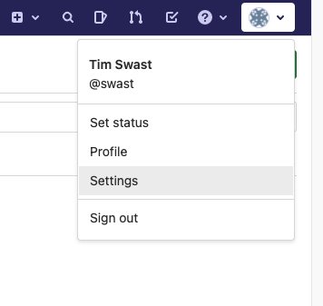
4. Select the  [SSH Keys](https://techx-gitlab.640k.net/-/profile/keys) item in the left navigation pane.
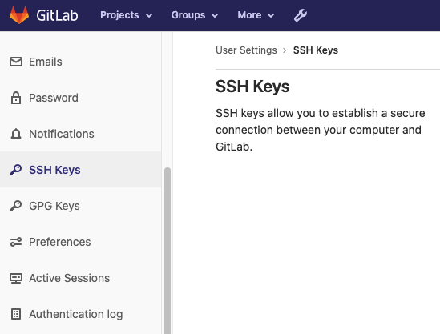
5. (In Cloud Shell) Reconnect to Cloud Shell if it has disconnected. Display the SSH key you created and copy the output.

```
cat "$HOME/.ssh/id_ed25519.pub"
```

6. Paste the contents of the SSH key you created in Cloud Shell.
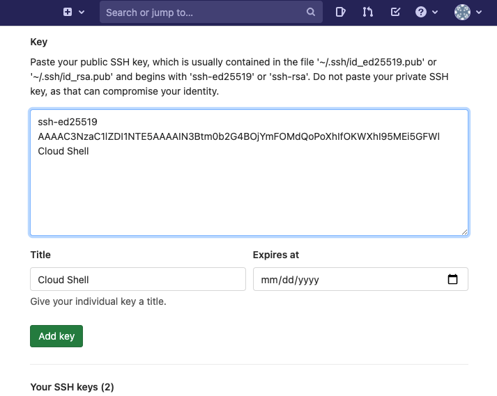
7. Click the "Add key" button.


## Clone a git repository


Next, "clone" a git repository that has been created for you. This downloads the current version of the code as well as any historical versions. Because every copy of the repository contains and can act on the complete version history, git is called a  ["distributed" version control system](https://en.wikipedia.org/wiki/Distributed_version_control).

1. Find the `lesson01-git` project in GitLab that the instructors have created for you. Navigate to Projects -> Your projects in the top menu.
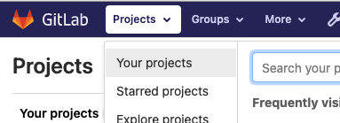
2. Click the `lesson01-git` project.
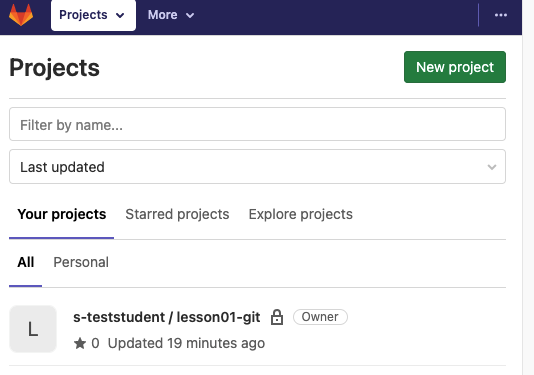

This should navigate you to `techx-gitlab.640k.net/s-YOUR_USERNAME/lesson01-git`.
3. Click the Clone button and copy the text in the "Clone with SSH" text box.
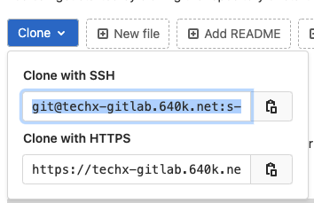
4. (In Cloud Shell) Clone the repository with the git clone command.

```
git clone git@techx-gitlab.640k.net:s-USER/lesson01-git.git
```

5. Change to the `lesson01-git` directory.

```
cd lesson01-git
```

6.  [Git "remotes"](https://git-scm.com/book/en/v2/Git-Basics-Working-with-Remotes) are pointers to external copies of the repository. This makes it easier to push your changes and pull the latest changes.

Use the git remote command to view the remotes for your repository.

```
git remote -v
```


You should see two entries for "origin" pointing to the repository you just cloned.


## Create a file with the Cloud Shell Editor


1. Click the pencil button   to open the code editor.
2. Click the files button   to open the files pane.
3. Click the "Open Folder" button to select a folder.
4. Select the `lesson01-git` folder corresponding to the git repository you just cloned.
5. Create a new file called hello.py
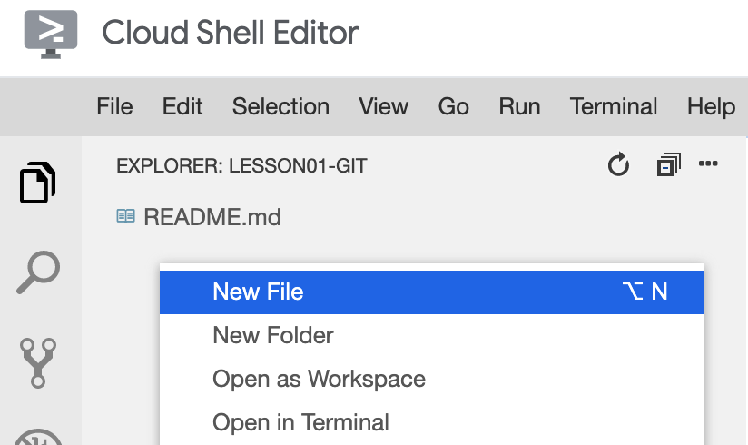
 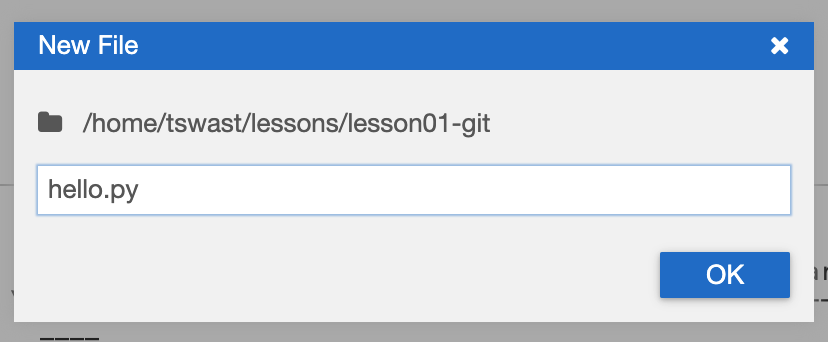
6. Add the text `print("Hello, World!")` to the file and save it.


## Add a commit with the git command line


A git "commit" is a pointer to a version of the repository. To upload your changes to GitLab, you'll first need to add a commit to your local repository history.

1. Open the Terminal in Cloud Shell Editor.
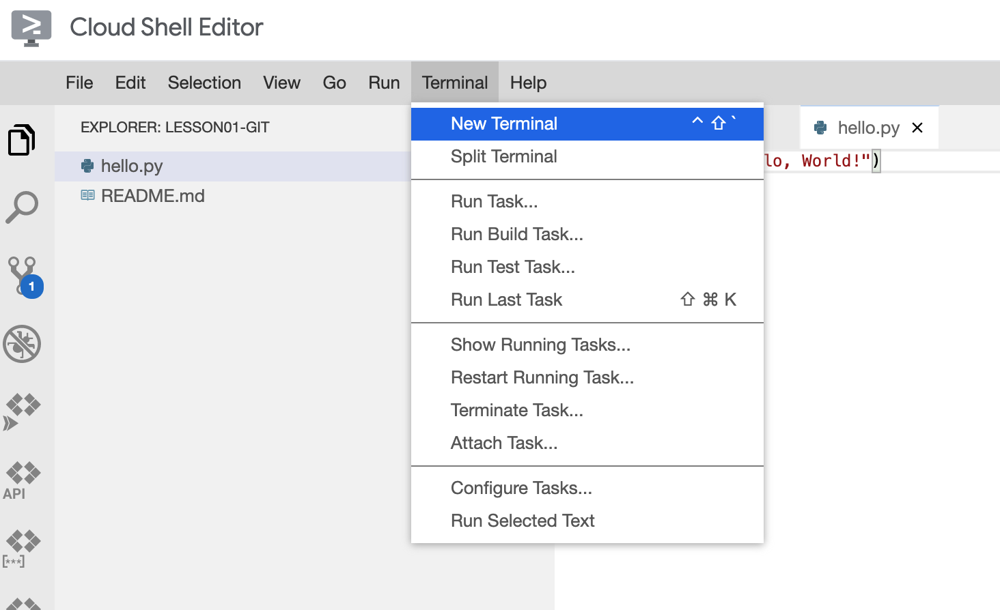
2. Run the git status command to see all the changes to your repository since the last commit.

```
git status
```

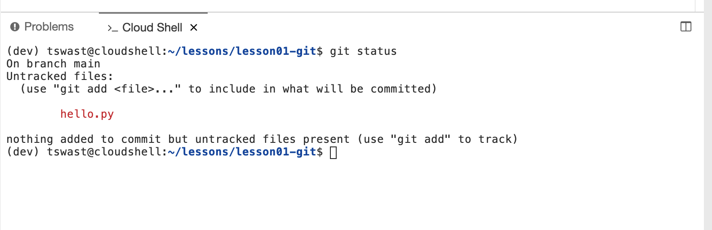

3. The red files in the "Untracked" section indicate files that have been modified, but haven't been added to your git "staging area". Use the git add command to add files to the staging area.

```
git add hello.py
```

4. Use the git status command again to see the staging area.

```
git status
```


You should see that hello.py has turned green and is in the "Changes to be committed" section.
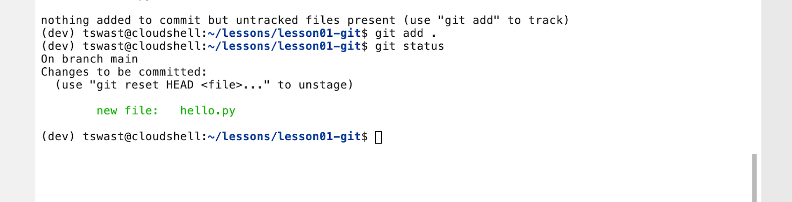

5. Use the git commit command to save all the changes in your staging area as new version.


```
git commit -m 'added initial Python code'
```


The "-m" option provides a log message describing the changes. Your collaborators will see these messages, so be  [descriptive](https://chris.beams.io/posts/git-commit/)!

6. Run the git log command to see the new version you've added.

```
git log
```

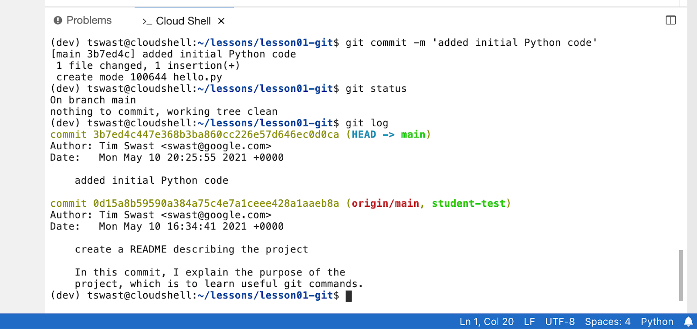


## Backing up your changes


A versioned history is useful locally to see what changes you've made and why, but it isn't much good to your collaborators if the code stays on your machine.

1. Push your code to GitLab to allow collaborators to see it. It also allows the instructors to grade your projects and exercises, including this one!

Use the git push command to send your changes to GitLab.

```
git push origin main
```

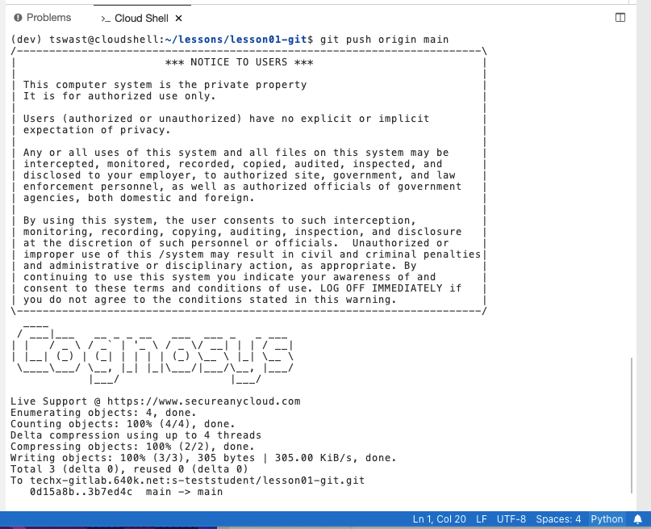

2. Open your repository in GitLab (`techx-gitlab.640k.net/s-USERNAME/lesson01-git`) and see that your changes have been backed up.

3. Open the Repository -> Commits page to see the full version history.
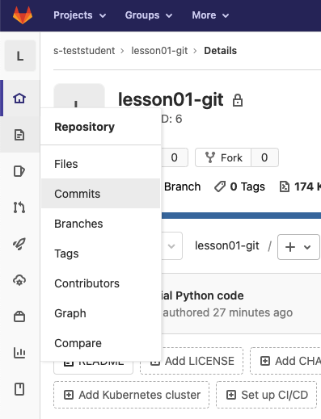
 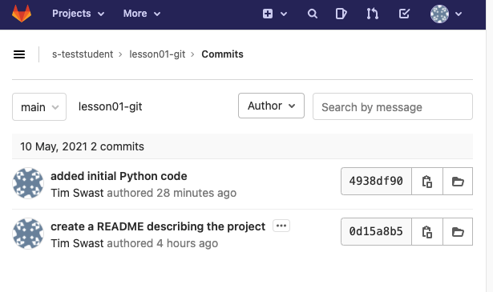


## Working with branches


One of the benefits of Git is that it's very easy to create "branches", which can be used to test out changes and experiment without affecting the main copy.

1. Create a branch with the git checkout command.

```
git checkout -b goodbye origin/main
```

2. Run the git status command to see that the current branch has changed from "main" to "goodbye".

```
git status
```

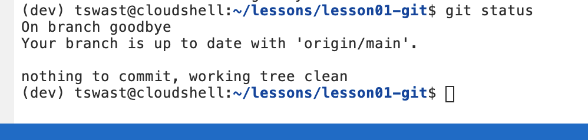


3. Open the `hello.py` file in Cloud Shell Editor and add a new line of code to the bottom of the file.

```
print("See you later!")
```

4. Save your changes to `hello.py`.
5. In the Terminal, use the git diff command to see your changes.

```
git diff -- hello.py
```

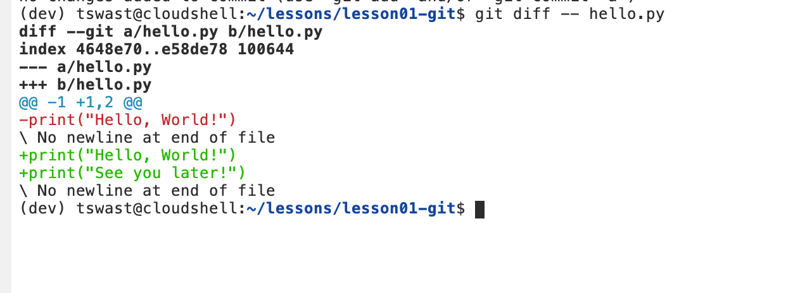


6. Add your changes to the staging area.

```
git add hello.py
```

7. Commit your changes to the "goodbye" branch.

```
git commit -m "add goodbyes to Python script"
```

8. Push your branch to GitLab.

```
git push origin goodbye
```

9. Select the "goodbye" branch in GitLab to see your changes.
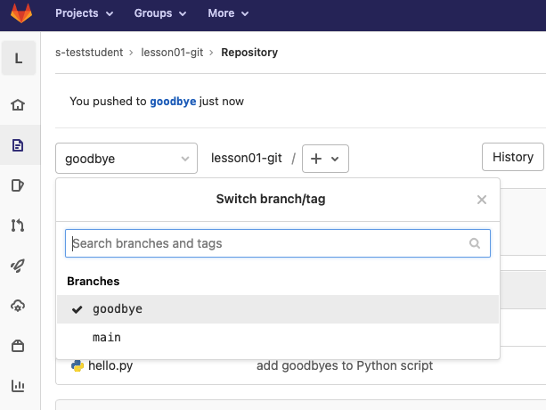


## Merging changes


Once your feature is ready, you'll want to include it back in the main branch of your repository. Git provides a merge command to pull changes from one branch to another.

1. In the Terminal pane, switch back to the main branch of your repository with the git checkout command.

```
git checkout main
```


When run without the -b option, the checkout command switches to a branch rather than create a new one.

2. To simulate work on the main branch, create an empty file called `test.txt`.
3. Add the file to your staging area.

```
git add test.txt
```

4. Commit the changes to your main branch.

```
git commit -m 'add test data'
```

5. Next, pull in your changes from the "goodbye" branch with the git merge command.

```
git merge goodbye
```


This opens a command line text editor to allow you to modify the commit message. Save the file without making changes.

6. View the commit history with the git log command.

```
git log
```

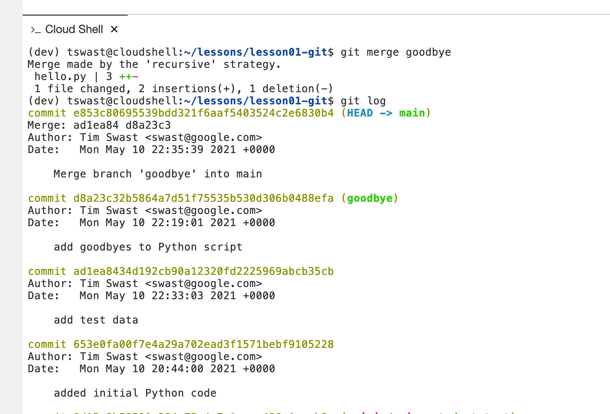


## Finishing up


Congrats! You've successfully used Git to track source code versions.

1. Push your changes to GitLab so that the instructor can grade completion of this exercise.

```
git push origin main
```


