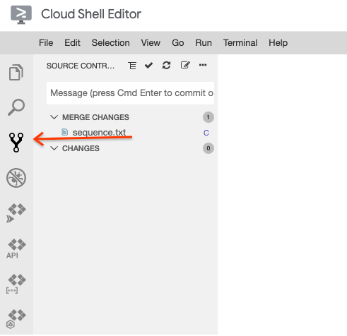
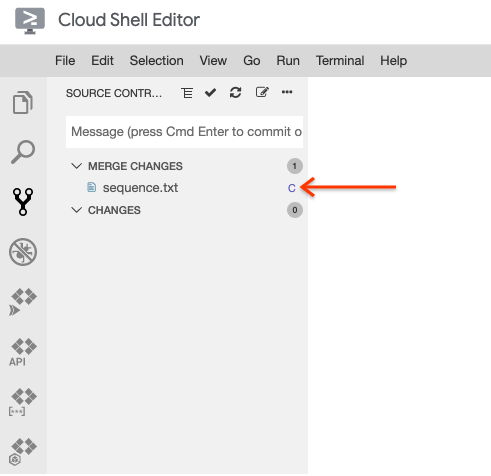
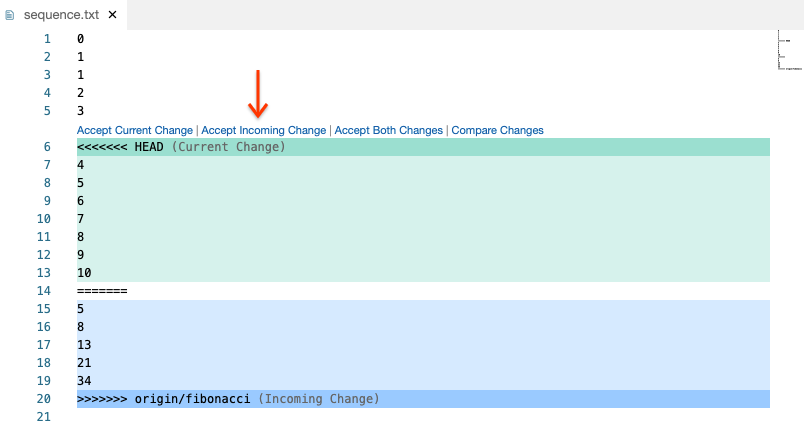

# Handling Conflicts with Git


## Overview


Whenever multiple people work on the same project, conflicts can arise. This is also true with version control. In this codelab, you'll create some artificial conflicts and then resolve them using the Git command line and Cloud Shell Editor.

### Prerequisites

* Using Cloud Shell and Cloud Shell Editor ( [codelab](https://google-techx.github.io/software-development-studio/01a-cloud-shell/?index=/software-development-studio/#0))
* Using Git ( [codelab](https://google-techx.github.io/software-development-studio/01b-git/?index=/software-development-studio/#0))

### What you'll need

* Google account
* GitLab account
* Web browser (Google Chrome recommended)

### What you'll learn

* Pull changes from GitLab
* Create a Git conflict
* Resolve a Git conflict


## Check out the code


Download a local copy of the repository the instructor has created to your development environment.

1. Open Cloud Shell.
2. Download the `s-USERNAME/lesson01-conflict` repository with the git clone command.

```
git clone git@techx-gitlab.640k.net:s-USER/lesson01-conflict.git
```

3. Open Cloud Shell Editor.
4. Set the working directory to the repository directory.


## Add a commit


In the repository, you should see a file named "sequence.txt" containing integers 1, 2, 3.

1. Add 7 additional lines to this file, counting from 1 to 10.
2. Open the Terminal in Cloud Shell Editor.
3. Add the "sequence.txt" file to your Git staging area.

```
git add sequence.txt
```

4. Commit your changes.

```
git commit -m 'create a sequence of natural numbers'
```

5. Push your changes to GitLab.

```
git push origin main
```


## Fetching code from a remote


The instructor has created a branch called "fibonacci". Download this branch and check it out.

1. Download the latest version of a branch from a remote using the git fetch command.

```
git fetch origin fibonacci
```

2. Use the git checkout command to view the code on that branch.

```
git checkout origin/fibonacci
```

> aside positive
> This allows you to view the code from a remote branch in a  ["detached HEAD" state](https://git-scm.com/docs/git-checkout#_detached_head). If you don't already have a local branch called "fibonacci", `git checkout fibonacci` does the same thing, but allows you to make changes locally.

3. View the "sequence.txt" file to see how it is different.
4. Explore the Git commit history with the git log command.

```
git log
```

5. Switch back to your main branch.

```
git checkout main
```


## Dealing with conflicts


In the last section, you saw that the "fibonacci" branch made a different set of changes to the "sequence.txt" file than you have made. This problem can often occur when working on the same project as other people. Luckily Git provides mechanisms for identifying and resolving these conflicting changes.

1. Attempt to pull in the changes from the fibonacci branch with the git merge command.

```
git merge origin/fibonacci
```

You should see the following output:

```
Auto-merging sequence.txt
CONFLICT (content): Merge conflict in sequence.txt
Automatic merge failed; fix conflicts and then commit the result.
```

2. Run the git status command to see which files were not merged.

```
git status
```

3. In addition to the command, Cloud Shell Editor can show conflicted files.

Open the version control pane in Cloud Shell Editor.

4. Find any files with the "C" status. This indicates that there is a merge conflict which you need to handle.

5. Click the filename to open it.
6. You'll see several options on how to handle the conflict. In this case, select "Accept incoming change", as that corresponds to the version from the "fibonacci" branch.


7. Save the change to the file.
8. Add the file to your staging area.

```
git add sequence.txt
```

9. Commit the merge.

```
git commit
```

10. Push your changes to GitLab.

```
git push origin main
```


## Extra credit


If you have additional time, practice the version control skills you've learned by submitting an extra-credit coding project to a new branch of the repository used in this codelab.

1. Choose an  [integer sequence](https://oeis.org/) that hasn't been mentioned in this codelab.
2. In a programming language of your choice, write code to generate the first 100 elements of the sequence and save it to the sequence.txt.
3. Submit your code for grading by pushing it to a branch called "extra-credit".


