# Using the Git GUI in Cloud Shell Editor


## Overview


Now that you have some practice using the Git command-line tool, you can use the same commands via the Git plugin for Cloud Shell Editor. In this codelab, you'll create commits, fetch remotes, and merge branches using the Git GUI in Cloud Shell Editor.

### Prerequisites

* Cloud Shell
* Git

### What you'll need

* Google account
* GitLab account
* Web browser (Google Chrome recommended)

### What you'll learn

* Review common Git commands
* Add files to the Git staging area
* Create a commit
* Fetch a remote branch
* Merge changes from a branch
* Push changes to a remote branch


## Check out the code


Cloud Shell Editor works best once a Git repository is already cloned. Clone the repository with the Git command-line tool from Cloud Shell.

1. Login to our course GitLab server ( [https://techx-gitlab.640k.net/](https://techx-gitlab.640k.net/)).
2. Find the `s-USER/lesson01-git-gui` repository and copy the "Clone with SSH" path.
3. Open Cloud Shell.
4. Download the `s-USER/lesson01-git-gu` repository with the git clone command.

Replace the text after `git clone` with the path you copied from GitLab.

```console
git clone git@techx-gitlab.640k.net:s-USER/lesson01-git-gui
```

5. Open Cloud Shell Editor.
6. Set the working directory to the repository directory.


## Create a branch with the command palette


It's a good practice to create a new branch when working on a feature. When collaborating, this ensures you don't affect the main branch that your teammates are relying on until your code is tested and ready to be merged.

The Cloud Shell Editor provides keyboard-based shortcuts for creating new branches and checking out existing ones. Since Cloud Shell Editor is a deployment of Eclipse Theia, which is a fork of Visual Studio Code, these shortcuts are based on the Visual Studio Code "Command Palette" ( [https://code.visualstudio.com/docs/getstarted/userinterface#_command-palette](https://code.visualstudio.com/docs/getstarted/userinterface#_command-palette))

1. Open the "Command Palette" with the keyboard shortcut. On macOS, hold Command (⌘) + Shift + P. On Windows/Linux/Chromebook, hold Ctrl + Shift + P.
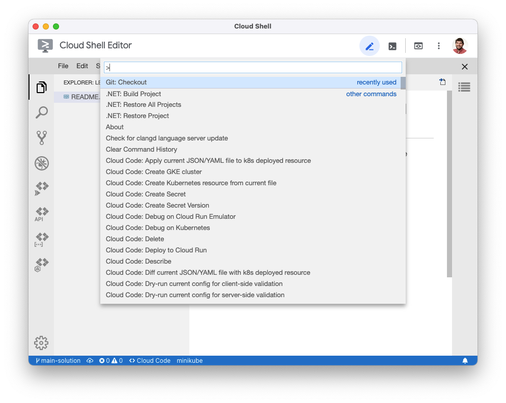
2. Type `Git: Checkout` in the palette, keeping the leading `>` character.
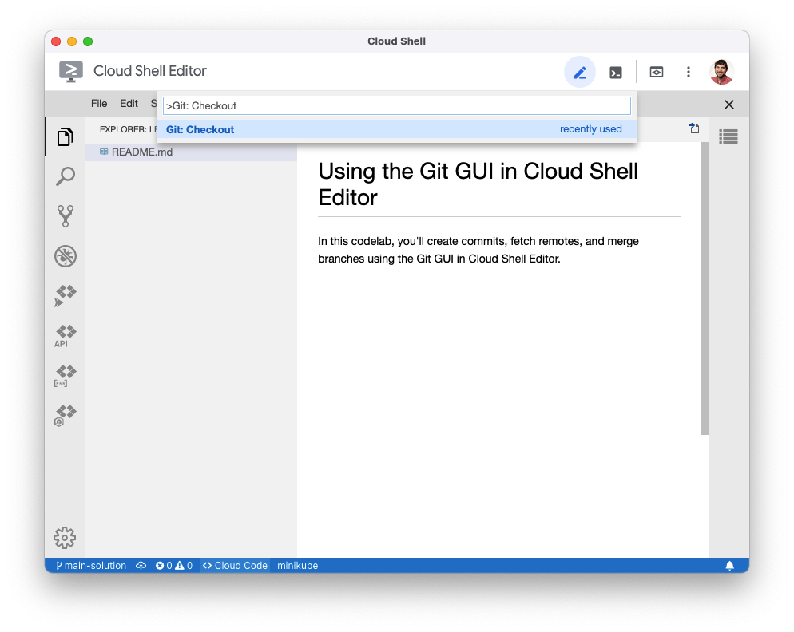
3. Press the "Enter" key to run the command.
4. Click "Create new branch..."
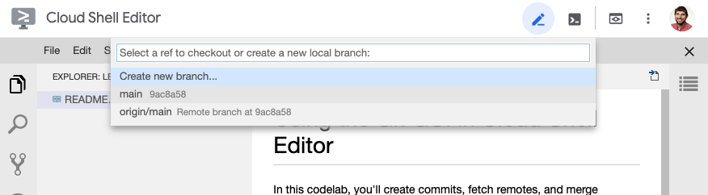
5. Type "all-caps" as the branch name. Press "Enter" to confirm.
6. Verify that "all-caps" now appears in the bottom-left corner, which indicates the current Git branch name.
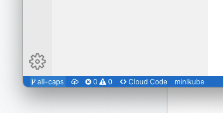


## Create allcaps.py


Chat users have been asking for a way to make it easier to SHOUT when their keyboards are missing the CAPS LOCK key. Create a Python script that converts command line input into ALL CAPS and prints it to the terminal.

1. Create a new file named `allcaps.py`.
2. Add the Python code.

```console
import sys

def print_allcaps(text: str):
    print(text.upper())


if __name__ == "__main__":
    print_allcaps(" ".join(sys.argv[1:]))
```

3. Any production program needs tests to ensure it works as expected. Create a new file named `allcaps_test.py`.
4. Add the test code.

```console
import pytest

import allcaps


@pytest.mark.parametrize(
    ["message", "expected"],
    [
        ("Hello, World!", "HELLO, WORLD!\n"),
        ("I'M ALREADY LOUD", "I'M ALREADY LOUD\n"),
        ("", "\n")
    ]
)
def test_print_allcaps(
    # capsys is a built-in test fixture
    # that allows pytest to check what has
    # been printed by the program.
    # https://docs.pytest.org/en/6.2.x/capture.html
    capsys,
    message,
    expected,
):
    allcaps.print_allcaps(message)
    captured = capsys.readouterr()
    assert captured.out == expected
```

5. Open the Terminal and verify that the tests pass.

```console
pytest allcaps_test.py
```


## Add files to the Git staging area


Use the Git GUI built in to Cloud Shell Editor to add the files you just created.

1. Click the Git icon to manage your Git repository.
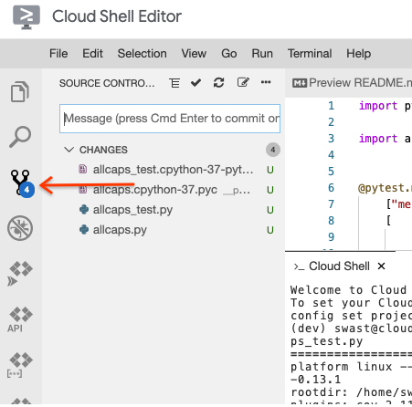
2. The files under "Changes" are the same as those that would appear under the "Untracked Changes" section when running the `git status` command.

Hover over "allcaps.py" and click the "+" button to add "allcaps.py to the Git staging area.
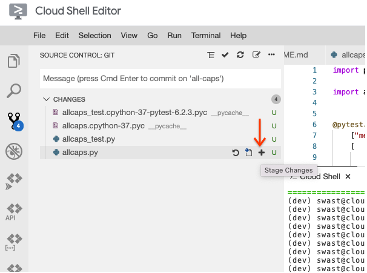
3. Do the same for the "allcaps_test.py" file.
4. Once both files are added to the "Staged Changes" menu, write a descriptive commit message in the text box that says "Message".
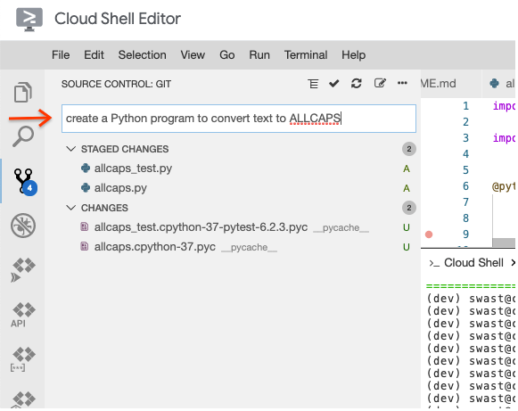
5. When everything is ready to be committed, click the checkmark (✔️) button to create a Git commit for these changes.
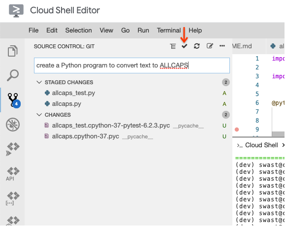


## Checkout the main branch


Now that the feature is ready, checkout the main branch.

1. Click the "all-caps" branch name in the bottom left corner.

This is a shortcut to the "Git: Checkout" command palette you used earlier.
2. Select "main" from the list of branches.
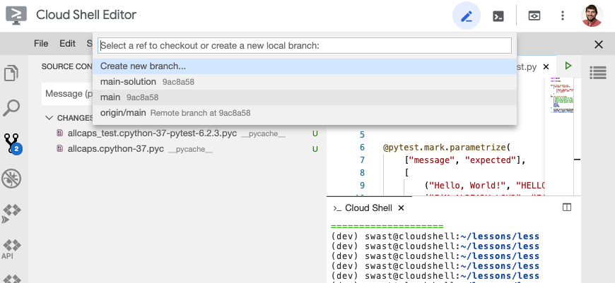
3. Verify that "main" is printed in the bottom left corner. Also, the Python files you created have disappeared.


## Merge the "all-caps" branch into "main"


Since the feature is ready, you may merge the changes into the "main" branch.

1. Select the Git icon if it isn't already selected.
2.  Select the three dots (...) and click the "Merge..." button.
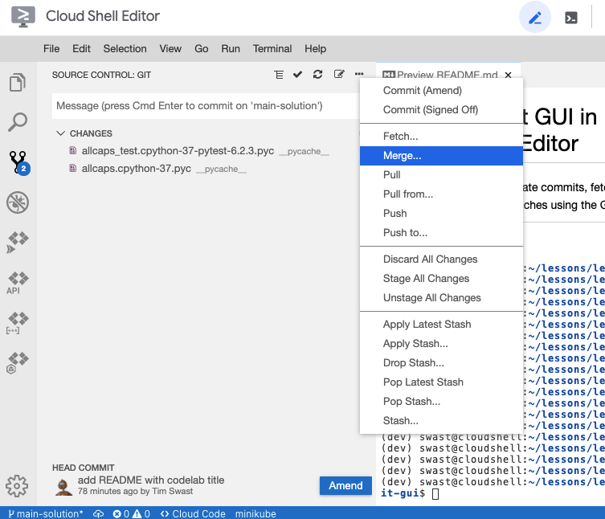
3. In the list of branches that appear in the command palette area, select "all-caps"
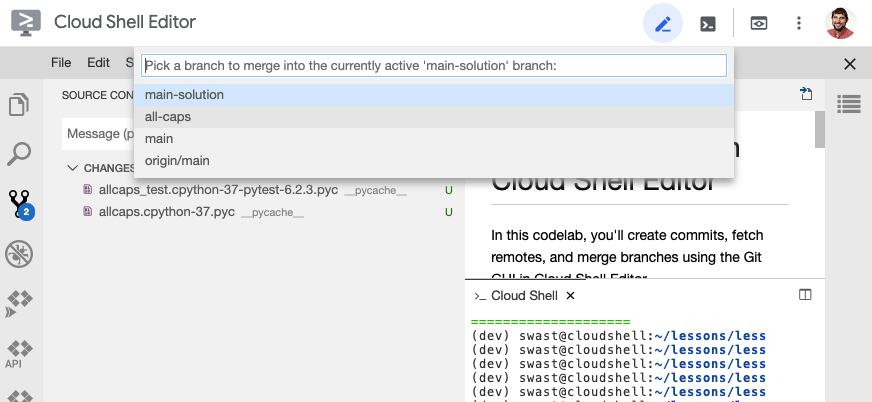
4. Verify that allcaps.py and allcaps_test.py now appear in the files list.

There weren't any conflicts in this merge, but if there are, refer to the  [Handling Conflicts with Git](https://google-techx.github.io/software-development-studio/01c-conflicts/?index=/software-development-studio/#0) codelab on how to resolve them.


## Finishing up


Now that the "main" branch has your new feature, push it to GitLab.

1. Select the Git icon.
2. Click the three dots (...).
3. Select the "Push to..." option.
4. Click the "origin" remote from the list in the command palette area.
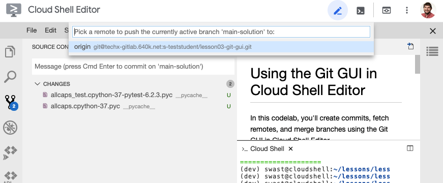
5. Verify that your changes have been pushed to GitLab.

In future codelabs, Git commands will shown as command line examples, but you may use the GUI if you find it more intuitive.


