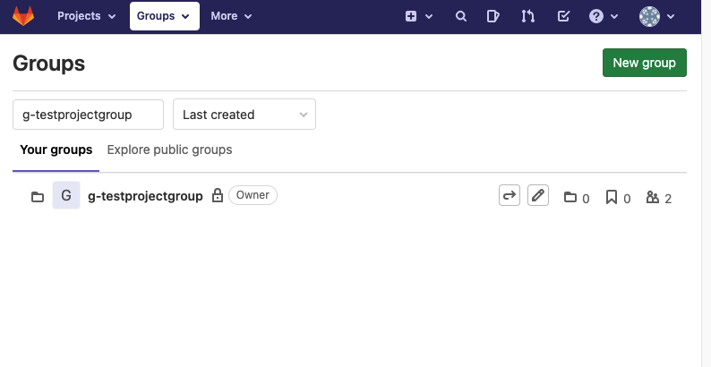
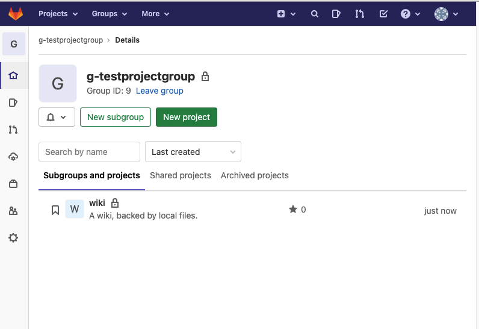
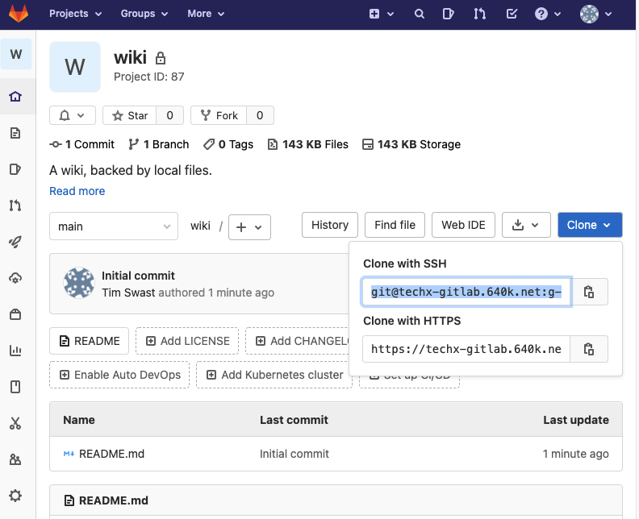

# Setup Your Wiki Repository


## Overview


In this codelab, create the foundation for your wiki. You'll also practice collaborating in real-time with your teammates on a shared code repository.

### Prerequisites

* Cloud Shell
* Git
* Linux command line

### What you'll need

* Google account
* GitLab account
* Web browser (Google Chrome recommended)

### What you'll learn

* Setup an empty Python repository
* Use cURL from the command-line to download a `.gitignore` file
* Collaborate with teammates in real-time


## Clone the repository


> aside positive
> All students should complete these steps.

The instructors have created a group and empty repository in GitLab. Find your repository and clone it to your development environment.

### Find the repository in GitLab

1. Navigate to "Groups" ( [https://techx-gitlab.640k.net/dashboard/groups](https://techx-gitlab.640k.net/dashboard/groups)) and find the group corresponding to your project group.

2. Click the name of the project group.
3. In the "projects" listing, click the "wiki" repository.

4. Click the Clone button to see the repository URLs.

5. Copy the text from Clone with SSH.

### Clone the repository in Cloud Shell

1. Navigate to the Google Cloud Console:  [https://console.cloud.google.com/](https://console.cloud.google.com/)
2. Click the Cloud Shell button   at the top of the screen.
3. Click the square button   to open Cloud Shell in a new window. 
4. Clone the repository with the git clone command.

Replace the `git@techx-gitlab.640k.net:g-GROUP_NAME/wiki.git` part after `git clone` with the "Clone with SSH" URL you copied from GitLab.

```console
git clone git@techx-gitlab.640k.net:g-GROUP_NAME/wiki.git
```

### Open the repository in Cloud Shell Editor

1. Click the pencil icon to open Cloud Shell Editor.
2. Navigate to the File -> Open Workspace menu button.
3. Select the "wiki" directory which has just been created.


## Configure the Git repository


Some files are undesirable to check into a Git repository. For example, they may be automatically generated, or they may be specific to a particular development environment. These files make the repository messy to review and aren't necessary for a developer using the project.

> aside negative
> One student should complete these steps. Share your screen as you do so!

1. Open the "Terminal" panel in Cloud Shell Editor.
2. A ".gitignore" file (note the leading "." character) tells Git which files are not needed to be tracked. 

Use cURL to download a ".gitignore" file with some useful defaults for Python.

```console
curl -L \
  https://raw.githubusercontent.com/github/gitignore/master/Python.gitignore \
  > .gitignore
```

3. Add all the changes you've made to the Git staging area.

```console
git add .gitignore
```

4. See which files have been staged.

```console
git status
```


You should see the following output:


```console
Changes to be committed:
  (use "git rm --cached <file>..." to unstage)

        new file:   .gitignore
```

5. Commit your changes.

```console
git commit -m 'add .gitignore for Python development'
```

6. Push your changes to GitLab.

```console
git push origin main
```

### Verify that .gitignore has been uploaded

> aside positive
> All students should complete these steps.

Download the code that your teammate just pushed and merge it with your local copy.

1. Download the code.

```console
git fetch origin main
```

2. Merge it into your local copy.

```console
git merge origin/main
```


If conflicts arise, refer to the  [Handling Conflicts with Git codelab](https://google-techx.github.io/software-development-studio/01c-conflicts/?index=/software-development-studio/#4).

3. Verify that you now have a ".gitignore" file with contents matching the file at  [https://github.com/github/gitignore/blob/master/Python.gitignore](https://github.com/github/gitignore/blob/master/Python.gitignore).

In other tutorials, you may see instructions that request you run `git pull origin main`. This command combines a "fetch" and "merge" in one step.


## Create an AUTHORS.txt file


In many projects, it's helpful to have a file listing everyone who has contributed to it. In this page, you'll create this file. Later, everyone will contribute their own names to the file.

> aside negative
> One student (different from the previous step) should complete these steps. Share your screen as you do so!

1. Create a file named "AUTHORS.txt".
2. Edit the file. Add a line containing your name, along with your email address. For example: "Tim Swast < [swast@google.com](mailto:swast@google.com)>"
3. Add the AUTHORS.txt file to the Git staging area.

```console
git add AUTHORS.txt
```

4. Commit your changes.

```console
git commit -m 'add AUTHORS.txt'
```

5. Push your changes to GitLab.

```console
git push origin main
```

### Verify that AUTHORS.txt has been uploaded

> aside positive
> All students should complete these steps.

Download the file that your teammate just pushed and merge it with your local copy.

4. Download the code.

```console
git fetch origin main
```

5. Merge it into your local copy.

```console
git merge origin/main
```

6. Verify that you now have an "AUTHORS.txt" file.


## Add other authors to the AUTHORS.txt file


Now that the file has been created, all team members can contribute their names to the file.

> aside negative
> To avoid conflicts, one student (different from the previous) should complete these steps. Repeat until all team members have added their names to the AUTHORS.txt file.

1. Edit the AUTHORS.txt file. Add a line containing your name, along with your email address. For example: "Tim Swast < [swast@google.com](mailto:swast@google.com)>"
2. Add the AUTHORS.txt file to the Git staging area.

```console
git add AUTHORS.txt
```

3. Commit your changes.

```console
git commit -m 'add my name to AUTHORS.txt'
```

4. Push your changes to GitLab.

```console
git push origin main
```

### Verify that AUTHORS.txt has been updated

> aside positive
> All students should complete these steps.

Download the file that your teammate just pushed and merge it with your local copy.

1. Download the code.

```console
git fetch origin main
```

2. Merge it into your local copy.

```console
git merge origin/main
```

3. If conflicts arise, refer to the  [Handling Conflicts with Git codelab](https://google-techx.github.io/software-development-studio/01c-conflicts/?index=/software-development-studio/#4). Unlike in that codelab, use the "Accept *both* changes" button when resolving the conflict.
4. Verify that all the expected names appear in the "AUTHORS.txt" file.


## Finishing up


Double-check that the code has been pushed by viewing the code on GitLab.

Continue to work together as a group, pushing your changes when you've added a feature, and pulling your teammates' changes often.


