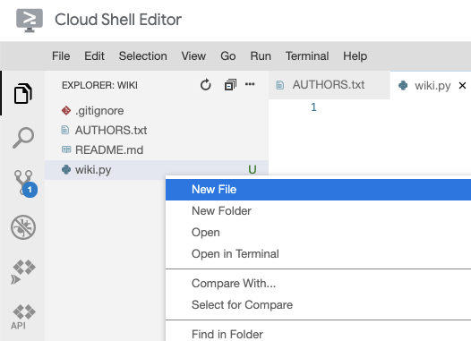
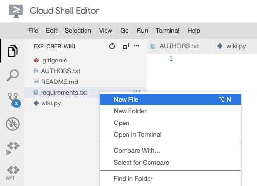
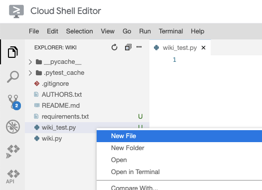
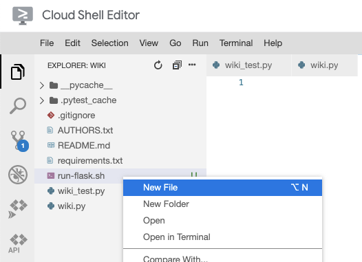
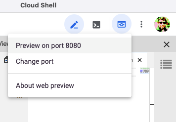

# Creating a Flask App


## Overview


In this codelab, you'll create and run a "hello world" Flask application. You'll also practice collaborating in real-time with your teammates on a shared code repository.

### Prerequisites

* Cloud Shell
* Git
* Python
* pytest

### What you'll need

* Google account
* GitLab account
* Web browser (Google Chrome recommended)

### What you'll learn

* Setup an empty Python repository
* Create a "hello world" Flask application
* Test a Flask application
* Collaborate with teammates in real-time


## Setup your development environment


In this codelab, you'll be working with your project groups on your wiki implementation. Open the source code for the wiki in Cloud Shell Editor.

> aside positive
> All students should complete these steps.

### Open the repository in Cloud Shell Editor

1. Click the pencil icon to open Cloud Shell Editor.
2. Navigate to the File -> Open menu button.
3. Select the "wiki" directory which you created last week.


## Create files needed for a Flask application


Next, add the "boilerplate" files needed for a Flask web application.

> aside negative
> One student should complete these steps. Share your screen as you do so!

### Create Python files

1. Create a file named "wiki.py".

2. So that you can test your code later, add code to the `wiki.py` file that prints "Hello, World!".

```
print("Hello, World!")
```

3. Check that your Python environment is set up correctly by running the "wiki.py" file. Open a new terminal panel and run the Python command.

```console
python wiki.py
```

### Push your changes to GitLab

If you successfully saw "Hello, World!" printed in the previous step, commit your changes and push them to GitLab so that your teammates can benefit from your work.

1. Add all the changes you've made to the Git staging area.

```console
git add .
```


The "." says to add all files Git finds in the current directory or sub-directories.

2. See which files have been staged.

```console
git status
```


You should see the following output:


```console
Changes to be committed:
  (use "git rm --cached <file>..." to unstage)

        new file:   wiki.py
```

If you see files you don't expect, check your ".gitignore" file to make sure it matches the recommended file at  [https://github.com/github/gitignore/blob/master/Python.gitignore](https://github.com/github/gitignore/blob/master/Python.gitignore).

3. Commit your changes.

```console
git commit -m 'add wiki Python module'
```

4. Push your changes to GitLab.

```console
git push origin main
```

### Verify that the package has been uploaded

> aside positive
> All students should complete these steps.

Download the code that your teammate just pushed and merge it with your local copy.

1. Download the code.

```console
git fetch origin main
```

2. Merge it into your local copy.

```console
git merge origin/main
```

If conflicts arise, refer to the  [Handling Conflicts with Git codelab](https://google-techx.github.io/software-development-studio/01c-conflicts/?index=/software-development-studio/#4).

3. Open the "Terminal" in Cloud Shell Editor.
4. Now, when you run your Python module, you'll see your code execute.

```console
python wiki.py
```


## Setup a application requirements


Your wiki depends on more than just the Python built-in modules. In a team environment, it's important to document which packages your application depends on so that your teammates can also run the code.

By convention, Python developers create a file named "requirements.txt" containing the package names and versions of all the necessary packages to run your application.

> aside negative
> One student (different from the previous) should complete these steps. Share your screen as you do so!

1. Create a file called `requirements.txt` to indicate which packages your code depends on.

2. Your wiki depends on Flask and pytest. Add these to the requirements.txt file you just created.

```console
Flask==1.1.2
pytest==6.2.3
```

3. Install these packages with the pip install command from the Terminal panel.

```console
pip install -r requirements.txt
```


Since you've already installed the necessary packages in the  [Using Python with Cloud Shell codelab](https://google-techx.github.io/software-development-studio/01a-cloud-shell/?index=/software-development-studio/#0), you should see "Requirement already satisfied".

### Push your changes to GitLab

Commit your changes and push them to GitLab so that your teammates can benefit from your work.

1. Add all the changes you've made to the Git staging area.

```console
git add .
```


The "." says to add all files Git finds in the current directory or sub-directories.

2. See which files have been staged.

```console
git status
```


You should see the following output:


```console
Changes to be committed:
  (use "git rm --cached <file>..." to unstage)

        new file:   requirements.txt
```

3. Commit your changes.

```console
git commit -m 'add list of app dependencies'
```

4. Push your changes to GitLab.

```console
git push origin main
```

### Verify that the requirements.txt file has been uploaded

> aside positive
> All students should complete these steps.

Download the code that your teammate just pushed and merge it with your local copy.

5. Download the code.

```console
git fetch origin main
```

6. Merge it into your local copy.

```console
git merge origin/main
```

7. Open the "Terminal" in Cloud Shell Editor.
8. Install the necessary packages.

```console
pip install -r requirements.txt
```


## Create a test file


It's good software engineering practice to have tests. Create a test file for your code.

> aside negative
> One student (different from the previous) should complete these steps. Share your screen as you do so!

1. Create a file named "wiki_test.py".

2. Add a test that checks that you can import the "wiki.py" file from test code.

```console
import wiki


def test_import():
    assert wiki is not None
```

3. In a Terminal panel, run this test with the pytest command.

```console
pytest wiki_test.py
```


You should see that 1 test has passed.

### Push your changes to GitLab

Commit your changes and push them to GitLab so that your teammates can benefit from your work.

5. Add all the changes you've made to the Git staging area.

```console
git add .
```


The "." says to add all files Git finds in the current directory or sub-directories.

6. See which files have been staged.

```console
git status
```


You should see the following output:


```console
Changes to be committed:
  (use "git rm --cached <file>..." to unstage)

        new file:   wiki_test.py
```

7. Commit your changes.

```console
git commit -m 'add list of app dependencies'
```

8. Push your changes to GitLab.

```console
git push origin main
```

### Verify that the test file has been uploaded

> aside positive
> All students should complete these steps.

Download the code that your teammate just pushed and merge it with your local copy.

9. Download the code.

```console
git fetch origin main
```

10. Merge it into your local copy.

```console
git merge origin/main
```

11. Open the "Terminal" in Cloud Shell Editor.
12. Run the test file.

```console
pytest wiki_test.py
```


## Setup a Flask application


Create a "Flask" application to be the web server for your wiki.

> aside negative
> One student (different from the previous) should complete these steps. Share your screen as you do so!

1. Replace the text in the `wiki.py` file with the code to create a Flask server.

```console
from flask import Flask

app = Flask(__name__)

@app.route("/")
def main():
    return "Hello, World!\n"
```

2. In a Terminal panel, run the Flask server with these three commands.

```console
export FLASK_APP=wiki
export FLASK_ENV=development
flask run -p 8080
```

3. Open a second Terminal panel (keeping the first one open).
4. In the second Terminal panel, use cURL to test your local web server.

```console
curl localhost:8080
```


You should see "Hello, World!" printed.

5. In the first Terminal panel, press the "Ctrl + C" shortcut to stop Flask from running. (Note: Control also on macOS, not ⌘)

### Push your changes to GitLab

Commit your changes and push them to GitLab so that your teammates can benefit from your work.

9. Add all the changes you've made to the Git staging area.

```console
git add .
```


The "." says to add all files Git finds in the current directory or sub-directories.

10. See which files have been staged.

```console
git status
```


You should see the following output:


```console
Changes to be committed:
  (use "git rm --cached <file>..." to unstage)

        modified:   wiki.py
```

11. Commit your changes.

```console
git commit -m 'create Hello World Flask application'
```

12. Push your changes to GitLab.

```console
git push origin main
```

### Verify that the application has been uploaded

> aside positive
> All students should complete these steps.

Download the code that your teammate just pushed and merge it with your local copy.

1. Download the code.

```console
git fetch origin main
```

2. Merge it into your local copy.

```console
git merge origin/main
```

3. Open the "Terminal" in Cloud Shell Editor.
4. In the Terminal panel, run the Flask server with these three commands.

```console
export FLASK_APP=wiki
export FLASK_ENV=development
flask run -p 8080
```

5. Open a second Terminal panel (keeping the first one open).
6. In the second Terminal panel, use cURL to test your local web server.

```console
curl localhost:8080
```


You should see "Hello, World!" printed.

7. In the first Terminal panel, press the "Ctrl + C" shortcut to stop Flask from running. (Note: Control also on macOS, not ⌘)


## Create a script to run Flask


Since it can be hard to remember the three commands to start the Flask server, create a script with these commands.

> aside negative
> One student (different from the previous) should complete these steps. Share your screen as you do so!

1. Create a new file named `run-flask.sh` in the root directory of the repository.

2. Add the three commands, as well as a "shebang" that indicates this file is a script.

```
#!/usr/bin/env bash

export FLASK_APP=wiki
export FLASK_ENV=development
flask run -p 8080
```

3. In the Terminal panel, make the script "executable" by running the `chmod` command.


```console
chmod +x run-flask.sh
```

### Try the server

Cloud Shell provides a web preview feature, which allows you to access your Flask server from a web browser. It prevents access from anyone but you by using your Google credentials.

Run the server and use the Cloud Shell web preview to access it.

1. In a Terminal panel, run the run-flask.sh script you just created.

```console
./run-flask.sh
```

2. In the top-right corner of the window, click the web preview   button and select "Preview on port 8080".

3. In the browser window that opens, you may have to select your Google account. Select the same one that you are using for Cloud Shell.
4. Verify that you see "Hello, World!" printed in the browser window.
5. Press "Ctrl + C" in the Terminal panel to stop the Flask server.

### Push your changes to GitLab

If you successfully saw "Hello, World!" printed in the previous step, commit your changes and push them to GitLab.

13. Add all the changes you've made to the Git staging area.

```console
git add .
```


The "." says to add all files Git finds in the current directory or sub-directories.

14. See which files have been staged.

```console
git status
```


You should see the following output:


```console
Changes to be committed:
  (use "git reset HEAD <file>..." to unstage)

        new file:   run-flask.sh
```

15. Commit your changes.

```console
git commit -m 'add command to run Flask server'
```

16. Push your changes to GitLab.

```console
git push origin main
```

### Verify that the Flask server has been uploaded

> aside positive
> All students should complete these steps.

Download the code that your teammate just pushed and merge it with your local copy.

17. Download the code.

```console
git fetch origin main
```

18. Merge it into your local copy.

```console
git merge origin/main
```

19. Open the "Terminal" in Cloud Shell Editor.
20. Run the Flask server.

```console
./run-flask.sh
```

21. In the top-right corner of the window, click the web preview   button and select "Preview on port 8080".
22. Verify that you see "Hello, World!" printed in the browser window.
23. Press "Ctrl + C" in the Terminal panel to stop the Flask server.


## Add tests for Flask homepage


It's important to add automated tests for all application code to ensure that your project continues to work as expected after making code changes. This is especially important when there are multiple contributors to the project.

Add tests to check that the Flask application is working properly.

> aside negative
> One student (different from the previous) should complete these steps. Share your screen as you do so!

1. Edit the "wiki_test.py" file and add a test that checks for "Hello, World!" in the home page.

```console
import pytest

import wiki


@pytest.fixture
def client():
    wiki.app.config["TESTING"] = True

    with wiki.app.test_client() as client:
        yield client


def test_import():
    assert wiki is not None


def test_homepage(client):
    resp = client.get("/")
    assert resp.status_code == 200
    assert b"Hello, World!\n" in resp.data
```


The "client" function is a  [pytest fixture](https://docs.pytest.org/en/6.2.x/fixture.html) that creates a  [Flask test client](https://flask.palletsprojects.com/en/1.1.x/testing/) ( [api reference](https://flask.palletsprojects.com/en/1.1.x/api/#flask.testing.FlaskClient),  [additional reference](https://werkzeug.palletsprojects.com/en/2.0.x/test/#werkzeug.test.Client)). This allows you to add a "client" argument to your tests, which you can use to make requests to your Flask application.

The result of calling the "client.get()" method is a  [Response](https://flask.palletsprojects.com/en/1.1.x/api/#response-objects) object, which contains useful properties such as "status_code" and "data". The assertions check that these are the expected values.

2. From a Terminal panel, run the test with the pytest command.

```console
pytest .
```

3. Verify that the tests have passed.

### Push your changes to GitLab

If the test passed in the previous step, commit your changes and push them to GitLab.

1. Add all the changes you've made to the Git staging area.

```console
git add .
```

2. See which files have been staged.

```console
git status
```


You should see the following output:


```console
Changes to be committed:
  (use "git reset HEAD <file>..." to unstage)

        modified:   wiki_test.py
```

3. Commit your changes.

```console
git commit -m 'add test for home page'
```

4. Push your changes to GitLab.

```console
git push origin main
```

### Verify that the tests have been uploaded

> aside positive
> All students should complete these steps.

Download the code that your teammate just pushed and merge it with your local copy.

5. Download the code.

```console
git fetch origin main
```

6. Merge it into your local copy.

```console
git merge origin/main
```

7. Open the "Terminal" in Cloud Shell Editor.
8. Run the test with the pytest command.

```console
pytest .
```

9. Verify that the test has passed.


## Finishing up


Double-check that the code has been pushed by viewing the code on GitLab.

You now have the necessary files in place to continue developing your wiki. In the Milestone 1 description, you will receive additional instructions about the expected next steps.

Continue to work together as a group, pushing your changes when you've added a feature, and pulling your teammates' changes often.


