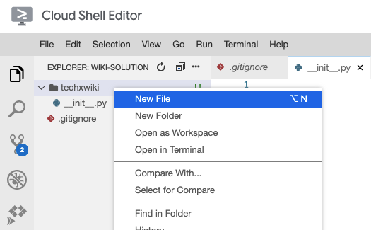

# Creating a Flask App


## Overview


In this codelab, you'll create and run a "hello world" Flask application. You'll also practice collaborating in real-time with your teammates on a shared code repository.

### Prerequisites

* Cloud Shell
* Git
* Python
* pytest

### What you'll need

* Google account
* GitLab account
* Web browser (Google Chrome recommended)

### What you'll learn

* Setup an empty Python repository
* Create a "hello world" Flask application
* Test a Flask application
* Collaborate with teammates in real-time


## Setup your development environment


In this codelab, you'll be working with your project groups on your wiki implementation. Open the source code for the wiki in Cloud Shell Editor.

> aside positive
> All students should complete these steps.

### Open the repository in Cloud Shell Editor

1. Click the pencil icon to open Cloud Shell Editor.
2. Navigate to the File -> Open menu button.
3. Select the "wiki" directory which you created last week.


## Configure the Git repository


Some files are undesirable to check into a Git repository. For example, they may be automatically generated, or they may be specific to a particular development environment. These files make the repository messy to review and aren't necessary for a developer using the project.

> aside negative
> One student should complete these steps. Share your screen as you do so!

1. Open the "Terminal" panel in Cloud Shell Editor.
2. A ".gitignore" file (note the leading "." character) tells Git which files are not needed to be tracked. 

Use cURL to download a ".gitignore" file with some useful defaults for Python.

```console
curl -L \
  https://raw.githubusercontent.com/github/gitignore/master/Python.gitignore \
  > .gitignore
```

3. Add all the changes you've made to the Git staging area.

```console
git add .gitignore
```

4. See which files have been staged.

```console
git status
```


You should see the following output:


```console
Changes to be committed:
  (use "git rm --cached <file>..." to unstage)

        new file:   .gitignore
```

5. Commit your changes.

```console
git commit -m 'add .gitignore for Python development'
```

6. Push your changes to GitLab.

```console
git push origin main
```

### Verify that .gitignore has been uploaded

> aside positive
> All students should complete these steps.

Download the code that your teammate just pushed and merge it with your local copy.

1. Download the code.

```console
git fetch origin main
```

2. Merge it into your local copy.

```console
git merge origin/main
```

3. Verify that you now have a ".gitignore" file with contents matching the file at  [https://github.com/github/gitignore/blob/master/Python.gitignore](https://github.com/github/gitignore/blob/master/Python.gitignore).

In other tutorials, you may see instructions that request you run `git pull origin main`. This command combines a "fetch" and "merge" in one step.


## Create files needed for a Python project


Next, add the "boilerplate" files needed for a Python package.

> aside negative
> One student (different from the previous) should complete these steps. Share your screen as you do so!

### Create a Python package

Your wiki project is complex enough that it should eventually contain multiple code files. To facilitate that, create a Python "package" to contain your code.

1. Create a directory (folder) named "techxwiki".

2. Inside the "techxwiki" directory, create a file named "`__init__.py`". That's two underscore (_) characters before and after "init".

3. So that you can test your code later, add code to the `__init__.py` file that prints "Hello, World!".

```
print("Hello, World!")
```

4. Create a new file at the root of your repository called "setup.py". This will tell Python about your new Python package.

5. Add the package description to the setup.py file.

```console
from setuptools import setup

setup(
    name="techxwiki",
    packages=["techxwiki"],
)
```


The "name" argument tells Python the package name. The name determines how you'd install this package, if you were to upload the package to a Python package repository.

The "packages" argument tells Python which directories to include when installing your package.

### Install and manually test your Python package

Now that you've created the necessary files for a Python package, it's time to install it and try it out.

1. Open the "Terminal" in Cloud Shell Editor.
2. Install your package using the pip install command.

```console
pip install -e .
```


The "-e" option tells the pip command to install in "editable" mode. This means that any changes you make to your code will still apply to your package. Without this option, the pip install command creates a copy of your code when installing.

The "." option says to install the package from the current directory.

3. Now, when you import your package in a Python script, you'll see your code execute. Try it out with the "-c" option to Python.

```console
python -c 'import techxwiki'
```

### Push your changes to GitLab

If you successfully saw "Hello, World!" printed in the previous step, commit your changes and push them to GitLab so that your teammates can benefit from your work. If not, work with your teammates to debug before continuing.

1. Add all the changes you've made to the Git staging area.

```console
git add .
```


The "." says to add all files Git finds in the current directory or sub-directories.

2. See which files have been staged.

```console
git status
```


You should see the following output:


```console
Changes to be committed:
  (use "git rm --cached <file>..." to unstage)

        new file:   setup.py
        new file:   techxwiki/__init__.py
```

If you see files you don't expect, check your ".gitignore" file to make sure it matches the recommended file at  [https://github.com/github/gitignore/blob/master/Python.gitignore](https://github.com/github/gitignore/blob/master/Python.gitignore).

3. Commit your changes.

```console
git commit -m 'add empty techxwiki Python package'
```

4. Push your changes to GitLab.

```console
git push origin main
```

### Verify that the package has been uploaded

> aside positive
> All students should complete these steps.

Download the code that your teammate just pushed and merge it with your local copy.

1. Download the code.

```console
git fetch origin main
```

2. Merge it into your local copy.

```console
git merge origin/main
```

3. Open the "Terminal" in Cloud Shell Editor.
4. Install your package using the pip install command.

```console
pip install -e .
```

5. Now, when you import your package in a Python script, you'll see your code execute. Try it out with the "-c" option to Python.

```console
python -c 'import techxwiki'
```


## Setup a Flask application


Create a "Flask" application to be the web server for your wiki.

> aside negative
> One student (different from the previous) should complete these steps. Share your screen as you do so!

1. Modify the `techxwiki/__init__.py` file to create a Flask server.

```console
from flask import Flask

app = Flask(__name__)

@app.route("/")
def main():
    return "Hello, World!\n"
```

2. In a Terminal panel, run the Flask server.

```console
export FLASK_APP=techxwiki
export FLASK_ENV=development
flask run -p 8080
```

3. Open a second Terminal panel (keeping the first one open).
4. In the second Terminal panel, use cURL to test your local web server.

```console
curl localhost:8080
```


You should see "Hello, World!" printed.

5. In the first Terminal panel, press the "Ctrl + C" shortcut to stop Flask from running. (Note: Control also on macOS, not ⌘)

### Script to run Flask

Since it can be hard to remember the three commands to start the Flask server, create a script with these commands.

1. Create a new file named run-flask.sh in the root directory of the repository.

2. Add the three commands, as well as a "shebang" that indicates this file is a script.

```
#!/usr/bin/env bash

export FLASK_APP=techxwiki
export FLASK_ENV=development
flask run -p 8080
```

3. In the Terminal panel, make the script "executable" with the chmod command.


```console
chmod +x run-flask.sh
```

### Try the server

Cloud Shell provides a web preview feature, which allows you to access your Flask server from a web browser. It prevents access from anyone but you by using your Google credentials.

Run the server and use the Cloud Shell web preview to access it.

1. In a Terminal panel, run the run-flask.sh script you just created.

```console
./run-flask.sh
```

2. In the top-right corner of the window, click the web preview   button and select "Preview on port 8080".

3. In the browser window that opens, you may have to select your Google account. Select the same one that you are using for Cloud Shell.
4. Verify that you see "Hello, World!" printed in the browser window.
5. Press "Ctrl + C" in the Terminal panel to stop the Flask server.

### Push your changes to GitLab

If you successfully saw "Hello, World!" printed in the previous step, commit your changes and push them to GitLab.

5. Add all the changes you've made to the Git staging area.

```console
git add .
```


The "." says to add all files Git finds in the current directory or sub-directories.

6. See which files have been staged.

```console
git status
```


You should see the following output:


```console
Changes to be committed:
  (use "git reset HEAD <file>..." to unstage)

        new file:   run-flask.sh
        modified:   techxwiki/__init__.py
```

7. Commit your changes.

```console
git commit -m 'add Flask server'
```

8. Push your changes to GitLab.

```console
git push origin main
```

### Verify that the Flask server has been uploaded

> aside positive
> All students should complete these steps.

Download the code that your teammate just pushed and merge it with your local copy.

9. Download the code.

```console
git fetch origin main
```

10. Merge it into your local copy.

```console
git merge origin/main
```

11. Open the "Terminal" in Cloud Shell Editor.
12. Run the Flask server.

```console
./run-flask.sh
```

13. In the top-right corner of the window, click the web preview   button and select "Preview on port 8080".
14. Verify that you see "Hello, World!" printed in the browser window.
15. Press "Ctrl + C" in the Terminal panel to stop the Flask server.


## Add a Blueprint to handle wiki pages


Flask Blueprints allow an application to be split across multiple Python files. Create one which will be used for viewing your wiki pages.

> aside negative
> One student (different from the previous) should complete these steps. Share your screen as you do so!

1. Create a "viewer.py" file in the "techxwiki" directory.

2. Edit "viewer.py" and create the Flask Blueprint.


```console
from flask import Blueprint

bp = Blueprint("viewer", __name__, url_prefix="/view")

@bp.route("/")
def main():
    return "Hello, Blueprint!\n"
```


The "`url_prefix`" parameter tells Flask that this Blueprint should be used for URLs starting with "/view".

3. Edit "__init__.py" and register the Blueprint you just created.

```console
from flask import Flask

from . import viewer  # Add this line

app = Flask(__name__)
app.register_blueprint(viewer.bp)  # Add this line

@app.route("/")
def main():
    return "Hello, World!\n"
```

4. In the Terminal pane, run the Flask server.

```console
./run-flask.sh
```

5. In a second Terminal pane, make a request to your new Blueprint with cURL.

```console
curl localhost:8080/view/
```


Alternatively, open the web preview and navigate to the "/view/" page. You may have to delete "?authuser=0" from the URL.

6. Verify that you see "Hello, Blueprint!" printed.
7. In the first Terminal pane, press "Ctrl + C" to stop the Flask server.

### Push your changes to GitLab

If you successfully saw "Hello, Blueprint!" printed in the previous step, commit your changes and push them to GitLab.

16. Add all the changes you've made to the Git staging area.

```console
git add .
```


The "." says to add all files Git finds in the current directory or sub-directories.

17. See which files have been staged.

```console
git status
```


You should see the following output:


```console
Changes to be committed:
  (use "git reset HEAD <file>..." to unstage)

        modified:   techxwiki/__init__.py
        new file:   techxwiki/viewer.py
```

18. Commit your changes.

```console
git commit -m 'add Flask Blueprint'
```

19. Push your changes to GitLab.

```console
git push origin main
```

### 
Verify that the Flask Blueprint has been uploaded

> aside positive
> All students should complete these steps.

Download the code that your teammate just pushed and merge it with your local copy.

20. Download the code.

```console
git fetch origin main
```

21. Merge it into your local copy.

```console
git merge origin/main
```

22. Open the "Terminal" in Cloud Shell Editor.
23. Run the Flask server.

```console
./run-flask.sh
```

24. In a second Terminal pane, make a request to your new Blueprint with cURL.

```console
curl localhost:8080/view/
```

25. Verify that you see "Hello, Blueprint!" printed.
26. In the first Terminal pane, press "Ctrl + C" to stop the Flask server.


## Add tests


It's important to add automated tests to ensure that your project continues to work as expected after making code changes. This is especially important when there are multiple contributors to the project.

Add tests to check that the Flask application is working properly.

> aside negative
> One student (different from the previous) should complete these steps. Share your screen as you do so!

1. Create a directory called "tests".

2. Create a file called "test_techxwiki.py" in the tests directory.

3. Edit the "test_techxwiki.py" file and add a test that checks for "Hello, World!" in the home page.

```console
import pytest

import techxwiki

@pytest.fixture
def client():
    techxwiki.app.config["TESTING"] = True

    with techxwiki.app.test_client() as client:
        yield client


def test_homepage(client):
    resp = client.get("/")
    assert resp.status_code == 200
    assert b"Hello, World!\n" in resp.data
```


The "client" function is a  [pytest fixture](https://docs.pytest.org/en/6.2.x/fixture.html) that creates a  [Flask test client](https://flask.palletsprojects.com/en/1.1.x/testing/) ( [api reference](https://flask.palletsprojects.com/en/1.1.x/api/#flask.testing.FlaskClient),  [additional reference](https://werkzeug.palletsprojects.com/en/2.0.x/test/#werkzeug.test.Client)). This allows you to add a "client" argument to your tests, which you can use to make requests to your Flask application.

The result of calling the "client.get()" method is a  [Response](https://flask.palletsprojects.com/en/1.1.x/api/#response-objects) object, which contains useful properties such as "status_code" and "data". The assertions check that these are the expected values.

4. From a Terminal panel, run the test with the pytest command.

```console
pytest tests
```

5. Verify that the test has passed.

### Push your changes to GitLab

If the test passed in the previous step, commit your changes and push them to GitLab.

1. Add all the changes you've made to the Git staging area.

```console
git add .
```

2. See which files have been staged.

```console
git status
```


You should see the following output:


```console
Changes to be committed:
  (use "git reset HEAD <file>..." to unstage)

        new file:   tests/test_techxwiki.py
```

3. Commit your changes.

```console
git commit -m 'add test for home page'
```

4. Push your changes to GitLab.

```console
git push origin main
```

### Verify that the tests have been uploaded

> aside positive
> All students should complete these steps.

Download the code that your teammate just pushed and merge it with your local copy.

5. Download the code.

```console
git fetch origin main
```

6. Merge it into your local copy.

```console
git merge origin/main
```

7. Open the "Terminal" in Cloud Shell Editor.
8. Run the test with the pytest command.

```console
pytest tests
```

9. Verify that the test has passed.


## Finishing up


Double-check that the code has been pushed by viewing the code on GitLab.

You now have the necessary files in place to continue developing your wiki. In the Milestone 1 description, you will receive additional instructions about the expected next steps.

Continue to work together as a group, pushing your changes when you've added a feature, and pulling your teammates' changes often.


