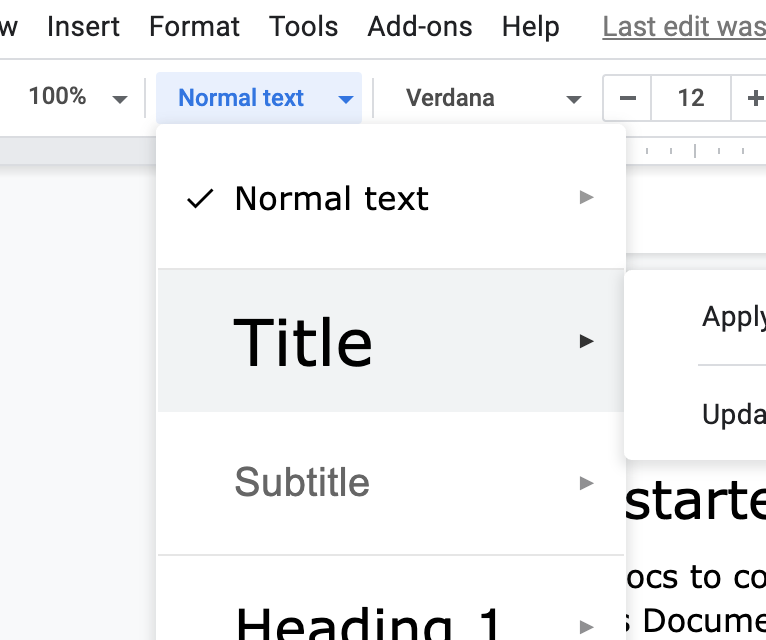
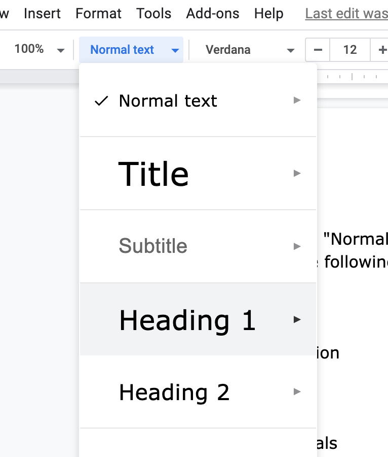
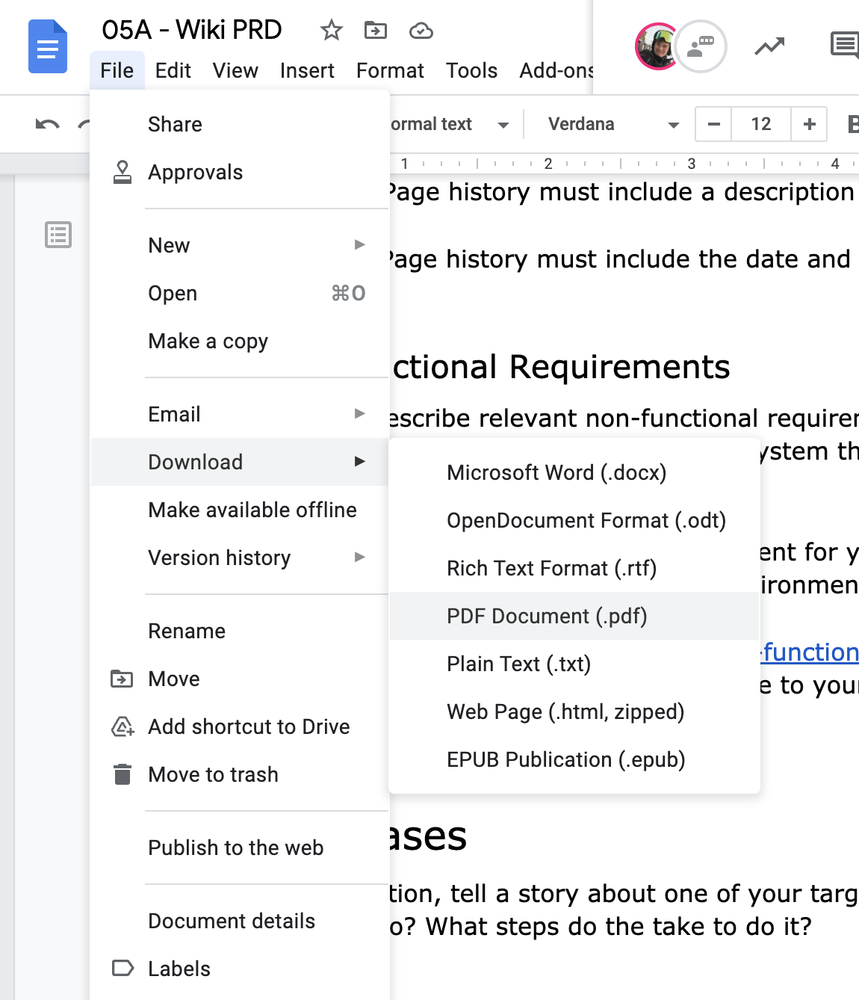

# Wiki Product Requirements Document (PRD)


## Overview


In this codelab, you'll describe the requirements and user stories for your wiki project.

### Prerequisites

* Cloud Shell
* Git

### What you'll need

* Google account
* GitLab account
* Web browser (Google Chrome recommended)

### What you'll learn

* Set project goals
* Define functional and non-functional requirements
* Write user stories to understand a product's requirements


## Getting started


Use Google Docs to collaborate with your teammates on a Product Requirements Document (PRD).

1. Create an empty Google Docs document. Tip:  [docs.new](http://docs.new/) is a  [Google-owned shortcut](https://support.google.com/a/users/answer/9308871?hl=en) that redirects to a new Google Docs document.
2. Share the document with your teammates. Grant them each Edit permissions.


3. Add a title to your document.

TeamName Wiki PRD
4. Set the style to "Title"

5. After the title, add a list of authors.

Authors:  [youremail@example.com](mailto:youremail@example.com),  [teammate@example.com](mailto:teammate@example.com)

Use the "Normal text" style for this.
6. Add the following sections:

Vision

Motivation

Goals

Non-goals

Functional Requirements

Non-functional Requirements

Use Cases
7. Set the style of each of the sections to "Heading 1".




## Wiki Vision and Goals


### Vision

In 1 or 2 sentences, describe the overall goal for your team's wiki. For example, Wikipedia's vision is "'To create and distribute a free encyclopedia of the highest possible quality to every single person on the planet in their own language." ( [source](https://en.wikipedia.org/wiki/Wikipedia:Prime_objective))

We suggest a more narrow topic than "encyclopedia" and a more narrow audience than "every single person on the planet" for this exercise. :-)

### Motivation

Describe the problem your wiki is trying to solve. For example, what is currently difficult to find, create, or navigate that your project could improve on.

For example consider Wikipedia's motivation. It was extremely slow to contribute to Nupedia (a free online encyclopedia) ( [source](https://en.wikipedia.org/wiki/History_of_Wikipedia#Formulation_of_the_concept)). Only a few articles were published per year, despite having many interested authors. A single full-time editor could not keep up. 

### Goals

How will you know that your project is successful? Write goals for your project based on the problem(s) you described in the previous sections.

For example, here are some goals for Wikipedia (based loosely on the  [Wikipedia pillars](https://en.wikipedia.org/wiki/Wikipedia:Five_pillars)):

* Wikipedia is an encyclopedia, containing comprehensive, notable, verifiable knowledge.
* Anyone can edit Wikipedia and see their contributions published quickly.
* Wikipedia is free content that anyone can use and distribute.

### Non-goals

What are some things your project might be used for that are not intended? This section can help determine which features you might *not* need to build. It can also help identify areas where features may need to be built to discourage certain behavior.

For example, here are some non-goals for Wikipedia (based loosely on the  [Wikipedia is not](https://en.wikipedia.org/wiki/Wikipedia:What_Wikipedia_is_not) article):

* A Wikipedia article should not be a complete exposition of all possible details.
* Wikipedia is not a dictionary, or a usage or jargon guide.
* Wikipedia is not a place to publish your own thoughts and analyses or to publish new information.
* Wikipedia is not a soapbox, a battleground, or a vehicle for propaganda, advertising and showcasing.
* Wikipedia is not a social networking service like Facebook or Twitter.


## Requirements


Set requirements for your wiki project. In each of these sections, number the requirements for ease of reference.

### Functional Requirements

What should the system do? What features are necessary to solve the problem?

This section should include at least the following:

1. View pages -- Once a page has been created, a read-only view is available to read.

You should add sub-requirements (1a, 1b, ...) describing necessary features of a page. For example, "1a. Pages can link to other pages in the wiki by page name"
2. Edit pages -- A user can edit any page.

You should sub-requirements (2a, 2b, ...) describing necessary features of editing. For example, how should users find the edit interface for a given page?
3. Page history -- It's possible to view a summary of all changes to a given page.

You should add sub-requirements (3a, 3b, ...). For example:

3a. Page history must include the name of the person who made the edit.

3b. Page history must include a description of the change.

3c. Page history must include the date and time of the change.

### Non-functional Requirements

Add and describe relevant non-functional requirements. Non-functional requirements describe behaviors of the system that aren't user-facing features.

An example of a non-functional requirement for your wiki is that "It must be runnable from a Linux command-line environment."

Pick a few of the examples from the  [Non-functional requirement Wikipedia article](https://en.wikipedia.org/wiki/Non-functional_requirement) and describe how they might relate to your wiki.


## Use Cases


In this section, tell a story about one of your target users. What are they trying to do? What steps do the take to do it?


## Finishing up


To turn in this assignment, share an exported PDF copy of your Product Requirements Document in your wiki project repository in GitLab.

### Download PDF

Download a PDF copy of your PRD document to your computer. Navigate to File -> Download -> PDF Document in the Google Docs menu.



### Open your development environment

1. Click the pencil icon to open Cloud Shell Editor.
2. Navigate to the File -> Open menu button.
3. Select the "wiki" directory which you created last week.

### Upload the PDF to Cloud Shell

1. Navigate to the File -> Upload Files... menu button.
2. Select the PDF file from your computer that you downloaded from Google Docs.

Note: Cloud Shell Editor may not be able to render the PDF. That's OK. You'll verify the file was correctly uploaded in a later step.
3. Make sure the file is in your "wiki" repository directory.

### Push to GitLab

1. Add the PDF to the Git staging area. Change the path to the name of your PDF file.

```console
git add wiki-prd.pdf
```

2. Commit your changes.

```console
git commit -m 'add wiki PRD'
```

3. Push your changes to GitLab.

```console
git push origin main
```

### Verify that the PDF has been uploaded

1. Navigate to your project group on the  [TechX GitLab instance](https://techx-gitlab.640k.net/).
2. Open your wiki repository.
3. Click the PRD PDF file.
4. Verify that you can see the PDF contents in the GitLab interface.


