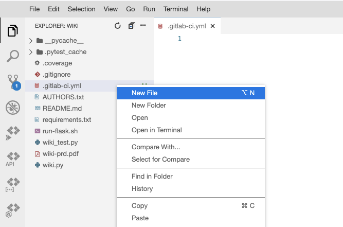
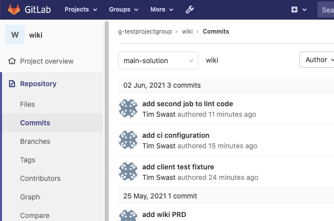
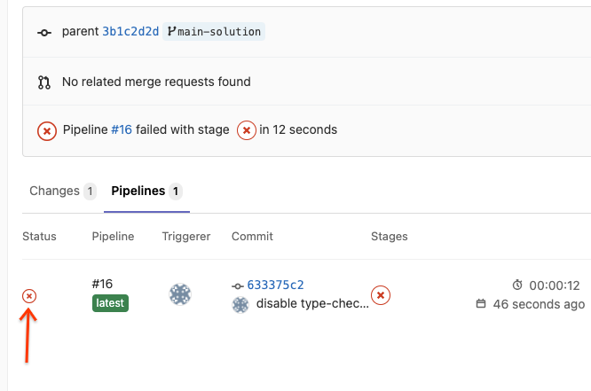
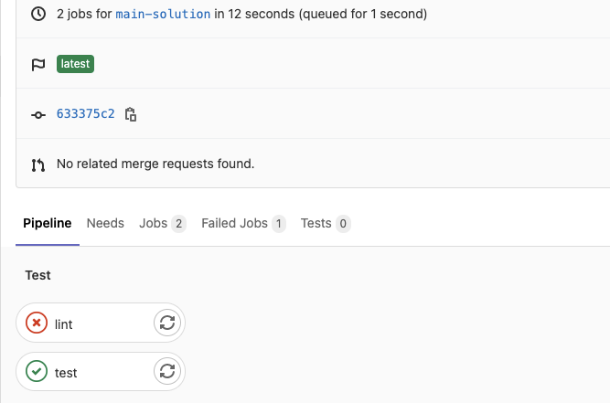
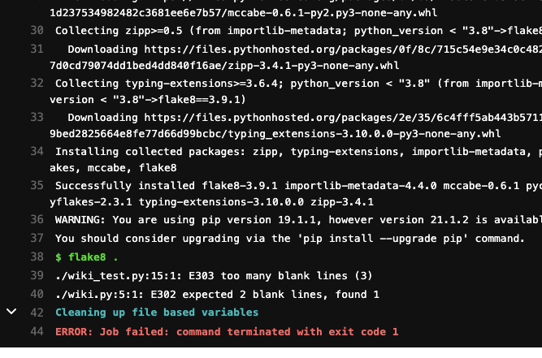

# Wiki Continuous Integration (Milestone 4)


## Overview


In this milestone, you'll setup continuous integration (CI) on your wiki repository and address issues that the tooling identifies.

This is expected to be completed as a group.

### Prerequisites

* You must have completed the "Wiki Setup" codelab with your project group.

### What you'll need

* Google account
* GitLab account
* Web browser (Google Chrome recommended)

### What you'll learn

* Configure GitLab continuous integration (CI)
* Run a Python linter (flake8) and address issues
* Automatically run tests
* Setup code coverage and add tests for uncovered code 


## Getting started


Configure GitLab Continuous Integration (CI) by creating the configuration file and pushing it to your main branch.

1. Create a file a the root directory of your repository called `.gitlab-ci.yml` (note the leading "." character).


2. At the start of the file, add a line describing the  [container image](https://docs.gitlab.com/ee/ci/yaml/README.html#image) to use.

```console
image: python:3.7.3
```

Since you're using Python 3.7.3 with Cloud Shell, use that version to make sure your CI system matches your development environment.

3. Add a job called "test" to the file that runs pytest on your code.

```console
test:
  script:
  - pip install -r requirements.txt
  - pytest .
```

4. Add a job called "lint" to the file that installs flake8 and executes it.

```console
lint:
  script:
  - pip install flake8==3.9.1
  - flake8 .
```

5. Check that your `.gitlab-ci.yml` file looks like the following:

```console
image: python:3.7.3
lint:
  script:
  - pip install flake8==3.9.1
  - flake8 .
test:
  script:
  - pip install -r requirements.txt
  - pytest .
```

6. Commit these changes and push them to your "main" branch.
7. On the GitLab interface for your wiki, check that the code has been pushed.
8. Navigate to the "Commits" panel.


9. Next to the latest commit, you should see a circular symbol. It may be a cross mark (❌), check mark (✅), or loading symbol (🌓). Click the symbol. This will take you to an overview page for the commit.
10. Next, click the symbol under the status column.



This should take you to an overview page for the continuous integration pipeline.
11. Here you see all the jobs that were ran in the pipeline and their status.


12. Click the name of the job (for example, "lint") to see the logs.



As you work on the requirements for this milestone, refer to these logs as you create additional jobs and address the issues each job finds.

To complete this milestone, you will need to create additional jobs and get these jobs to pass.


## Requirements


### 1 - GitLab CI is running in your GitLab repository

* Ensure that the `.gitlab-ci.yml` file is present and the GitLab web interface shows what was described in the Getting Started section.

### 2 - lint (flake8) is passing

* 2a. The "lint" job runs flake8 and passes.
* Note: You've already configured "flake8" to run in continuous integration in the Getting Started section. You'll need to address any issues it has found.
* Tip 1: As you work to address issues, you can run flake8 and the other tools in your development environment before pushing them to GitLab.
* Tip 2: Completing the extra credit may help with this requirement.

### 3 - type-check (mypy) is passing

* 3a. Install "mypy" to your development environment.

```console
pip install mypy==0.812
```


Remember to add mypy to your `requirements.txt` file!

* 3b. Add at least one type hint to your wiki program. For example, I added type hints to my page view request handler.

```console
@app.route("/view/<page_name>")
def view(page_name: str) -> str:
    return render_template("main.html", page_name=page_name)
```

* 3c. Run mypy in your development environment.

```console
mypy .
```

* 3d. Create a job called "type-check" in your `.gitlab-ci.yml` file.
* 3e. Add a script to the job that (1) installs mypy and any other dependencies for your project and (2) runs mypy.

### 4 - test (pytest) is passing

You might have noticed that some of your tests are failing when you looked at the logs in the Getting Started section. Some of these tests may indicate real bugs, in which case you should fix the bugs that they found. Some of the tests may need to be updated to match new requirements.

### 5 - All lines and branches are covered by tests

* 5a. Install pytest-cov to enable coverage report generation.


```console
pip install pytest-cov==2.11.1
```


Remember to add pytest-cov to your `requirements.txt` file!

* 5a. Update the "test" job in the `.gitlab-ci.yml` configuration file to create a coverage report when the pytest command is run.

Tip: Adjust this example from lecture to include a `--cov=modulename` argument for each module in your wiki project. Include test modules to ensure that all test code is being run.

```console
pytest . --cov=wiki --cov=wiki_test --cov-report term-missing --cov-branch
```

* 5b. Add tests as needed to cover missing lines and/or branches.


## Extra Credit


### Extra Credit - format (black) is passing

[Black](https://github.com/psf/black) is a community-standard code formatter for Python. This means that it automatically fixes many lint errors for you. It also provides a `--check` option to check if code has not been formatted.

* Extra (a). Install black.

```console
pip install black==21.4b2
```

* Extra (b). Run black on all of your source code.

black .

Tip: The first time you run a code formatter is likely to cause many git conflicts. Check with your teammates first to ensure that they do not have any work-in-progress before formatting the code.

* Extra (c). Black conflicts in a few spots with flake8. For example, black is more lenient with the 79 columns per row rule.

Add a `.flake8` configuration file that overrides just the rules that conflict with black. You can use  [https://raw.githubusercontent.com/googleapis/python-bigquery/master/.flake8](https://raw.githubusercontent.com/googleapis/python-bigquery/master/.flake8) for this purpose.

```console
curl https://raw.githubusercontent.com/googleapis/python-bigquery/master/.flake8  > .flake8
```

* Extra (d). Add a "format" job to your `.gitlab-ci.yml` configuration file that runs black in `--check` mode.

### Extra Credit - pre-commit is configured

Do not complete this until flake8 is passing and black has been run.

It's common to forget to run the formatter when you are developing your code. Git provides a way to automatically run certain programs whenever you commit with what's called a  ["pre-commit" hook](https://githooks.com/).

There is a Python program called  [pre-commit](https://pre-commit.com/#intro) that can make managing these hooks easier.

* Extra (a) Install pre-commit.

```console
pip install pre-commit==2.12.1
```

* Extra (b) Create a file called `.pre-commit-config.yaml` with configurations for "black", "flake8", and other useful helpers.

```console
repos:
-   repo: https://github.com/pre-commit/pre-commit-hooks
    rev: v3.4.0
    hooks:
    -   id: trailing-whitespace
    -   id: end-of-file-fixer
    -   id: check-yaml
-   repo: https://github.com/psf/black
    rev: 21.4b2
    hooks:
    - id: black
-   repo: https://gitlab.com/pycqa/flake8
    rev: 3.9.1
    hooks:
    - id: flake8
```

* Extra (c) Create the git pre-commit hooks.

```console
pre-commit install
```


For the best outcome, all of your teammates should also complete this step after you've committed and pushed the `.pre-commit-config.yaml` file.


## Grading rubric


Remember: to receive a grade, you must submit a peer feedback form indicating which work you did and which was done by your teammates. Non-coding tasks such as help debugging also counts towards participation. This link will be generated and emailed to you after the due date.

* 10% - Requirement (1) -- GitLab CI is running in your GitLab repository
* 30% - Requirement (2) -- lint (flake8) is passing
* 20% - Requirement (3) -- type-check (mypy) is passing
* 30% - Requirement (4) -- test (pytest) is passing
* 10% - Requirement (5) -- All branches are covered by tests
* 3% (extra credit) -- format (black) is passing
* 2% (extra credit) -- pre-commit is configured


