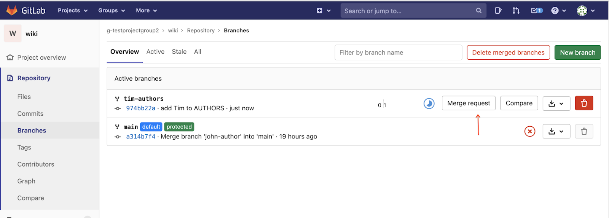

# Choosing a License


## Overview


In this codelab, you'll choose and apply an open source license for your wiki projects.

### Prerequisites

* Using Cloud Shell and Cloud Shell Editor ( [codelab](https://google-techx.github.io/software-development-studio/01a-cloud-shell/?index=/software-development-studio/#0))
* Using Git ( [codelab](https://google-techx.github.io/software-development-studio/01b-git/?index=/software-development-studio/#0))
* Creating Merge Requests on GitLab

### What you'll need

* Google account
* GitLab account
* Web browser (Google Chrome recommended)

### What you'll learn

* Using collaboration tools to document a group decision
* Practice creating a merge request
* Assign a license to a code repository


## Choose a license


As a group, decide on an  [open source license](https://opensource.org/licenses) for your wiki project.

To help you decide, you may reference several public resources:

*  [Choose A License](https://choosealicense.com/licenses/)
*  [Open Source Initiative](https://opensource.org/licenses)
*  [Google Open Source documentation](https://opensource.google/docs/thirdparty/licenses/#types)

To decide, you may want to propose a few and vote on them. The  [Apache organization recommends a -1, 0, +1 voting system](https://www.apache.org/foundation/voting#expressing-votes-1-0-1-and-fractions) for group decisions, where +1 means yes, -1 means no (true veto), and 0 or anything in-between -1 and +1 means maybe/maybe-not.


## Create a merge request


Once you have chosen a license,

1. Create a new branch called "license" in your wiki repository.

```console
git checkout -b license
```

2. Create a file called "LICENSE.txt" with the contents of the license you've chosen. Here are links to license texts that we have discussed.

**Apache 2.0:**  [https://www.apache.org/licenses/LICENSE-2.0.txt](https://www.apache.org/licenses/LICENSE-2.0.txt)

**BSD:**  [https://opensource.org/licenses/BSD-3-Clause](https://opensource.org/licenses/BSD-3-Clause)

**MIT:**  [https://opensource.org/licenses/MIT](https://opensource.org/licenses/MIT) 

**GPL:**  [https://www.gnu.org/licenses/gpl-3.0.txt](https://www.gnu.org/licenses/gpl-3.0.txt)

**LGPL:**  [https://www.gnu.org/licenses/lgpl-3.0.txt](https://www.gnu.org/licenses/lgpl-3.0.txt)


3. Add the LICENSE.txt file to your git staging area. Commit your changes. Push your branch to GitLab.
4. Create a merge request for this change.




## Approve merge request


To verify that every author is OK with the license, each student in your group and the contributor group should approve the merge request.

1. In the GitLab interface, click the Approve button (if you approve) to accept the Merge Request.


2. Do the same for the Merge Request on the group wiki you are contributing to.


## Finishing up


Once the Merge Request is approved by everyone, merge the license into the main branch.


Check that "LICENSE.txt" appears in the main branch of your wiki repository and it contains the expected text.


