# Migrating Repositories to Public GitLab


## Overview


During this course, you've used the private GitLab instance at  [techx-gitlab.640k.net](https://techx-gitlab.640k.net/). After this course completes, this instance will be shutdown and removed. In addition to private instances, GitLab provides a public instance (Software as a Service / SaaS) with  [free hosting for individuals](https://about.gitlab.com/pricing/).

In this codelab, you'll migrate the source code for your wiki projects to a public GitLab repository so that you reference it from your resumes and continue to improve it.

### What you'll need

* Google account
* Web browser (Google Chrome recommended)

### What you'll learn

* Upload files to Cloud Shell Editor
* Write a project summary in Markdown
* Configure GitLab Software as a Service (SaaS)
* Use "remotes" in the Git command-line


## Upload screenshots of your wiki


As you know, Cloud Shell limits access to your wikis to just the user who is running the Flask web server. This makes it difficult for people to see what it is you've built.

To allow people to see what you've built, add some screenshots to your wiki repository.

> aside positive
> Complete these steps with your project groups. One student should share their screen while the others help navigate.

1. For each kind of page in your wiki (home page, view, edit, history), take a screenshot.

On Chromebooks, press Ctrl + Show Windows   to take a full-screen screenshot or Shift + Ctrl + Show windows   to take a screenshot of just a part of the screen.
2. In Cloud Shell Editor, create a directory called "screenshots".
3. Navigate to the File -> Upload Files... menu button.
4. For each screenshot, select the file from your computer.
5. Make sure the file is in your "screenshots" directory. If not, move it to the correct location.
6. Add the screenshots directory to your git staging area.
7. Commit your changes and push to GitLab.


## Create a README


A README file is the first thing most people will see when viewing a code repository. Make sure to highlight the important information about your project in this file to leave a good impression!

### Markdown syntax

GitLab supports Markdown for formatting text in files ending with the `.md` file extension. Reference this Markdown cheatsheet as you create a README file for your wiki repository.

**Top-level heading (title / h1)**

```console
# Wiki - Built with Python and Flask
```

**Paragraphs**

```console
Paragraphs are useful whitespace.

Separate paragraphs by a completely empty line.
```

**Second-level headings (section / h2)**

```console
## License
```

**Links**

```console
[text in square brackets](https://example.com/url/in/parentheses)
```

**Images**

```console

```

**Plain text / Code / Command-line formatting**

```console
```
anything between three "backticks"
is rendered with a code (monospace) font
```
```

### Author the README file

> aside positive
> Complete these steps with your project groups. One student should share their screen while the others help navigate.

Follow these steps to create the README file. You may use the text provided or modify it to better suit your particular project.

1. Create a README file named `README.md` for your wiki project.

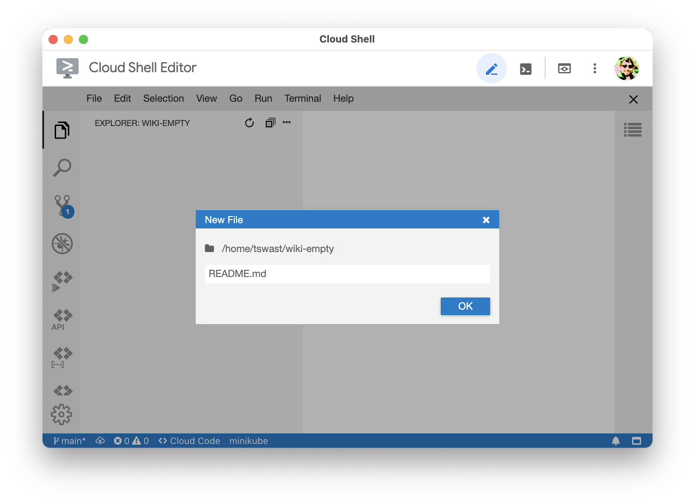

2. By default, Cloud Shell Editor opens a preview of Markdown files. Double click the body of the file to open the editor.

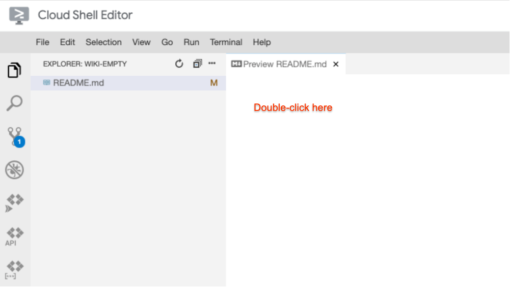

 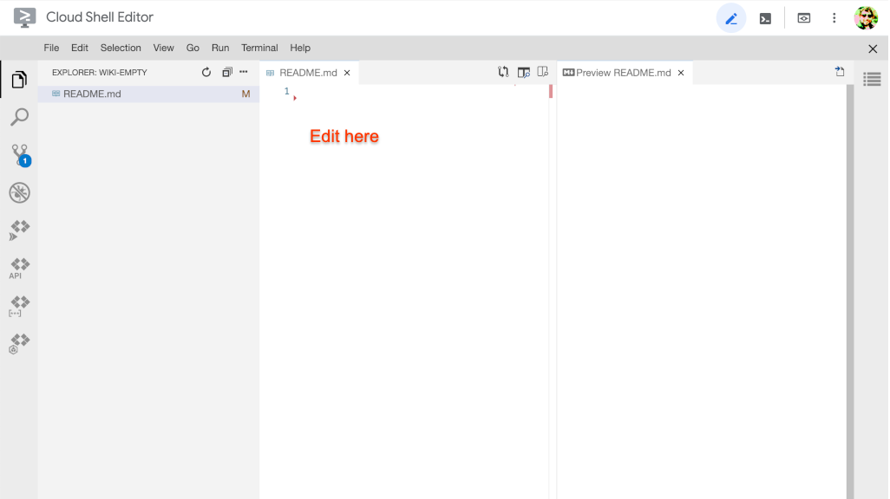

3. Add a top-level heading (title) to your README. Usually, this is the project name.


```console
# Wiki - Built with Python and Flask
```

4. Create a blank line after the heading, then add a short (1-3 sentences) summary of the project.

```console
# Wiki - Built with Python and Flask

A wiki server that uses text files on the local filesystem to store page data.
```

5. Create a sub-section for Screenshots after the summary.

```console
A wiki server ...

## Screenshots
```

6. Include a couple of images to highlight the project. Use relative links so that the images render correctly when uploaded to GitLab. Also, include alt-text for accessibility.

```console
## Screenshots


```

7. Include an "Installation" sub-section describing what is needed to run the project.

```console
## Screenshots

...

## Installation

This project has been tested with Python 3.7.3. To install the necessary dependencies, first create and activate a virtual environment.

```
# Create a directory to store virtual environments.
mkdir "$HOME/venvs"

# Create the virtual environment.
python3 -m venv "$HOME/venvs/dev"

# Activate the virtual environment.
# This must be done every time you open a terminal.
# You may want to add this to your .bashrc file.
source "$HOME/venvs/dev/bin/activate"
```

Install the necessary dependencies with pip.

```
pip install -r requirements.txt
```
```

8. Add a "Usage" sub-sections describing how to run the project.

```console
## Installation

...

## Usage

Run the web server.

```
./run-flask.sh
```

Access the wiki by opening a web preview browser tab on port 8080.
```

9. Add a sub-section for the project license. Include the name of the license your group has chosen, as well as a link to the LICENSE.txt file.

```console
## Usage

...

## License

Apache 2.0, see [LICENSE.txt](LICENSE.txt).
```

10. Finally, add the changes to your git staging area, commit, and push to GitLab.
11. Verify that the README renders as expected when you browse your wiki repository on GitLab.


## Configure GitLab SaaS


Until now, you've been using a private GitLab server, hosted by the instructors. This server will be shutdown and removed shortly after the class, so you'll need to migrate your repositories to a public GitLab server.

> aside positive
> Each student should complete these steps. 

1. Navigate to the public landing page for GitLab at  [gitlab.com](https://gitlab.com/).
2. Click the "Sign in" button.

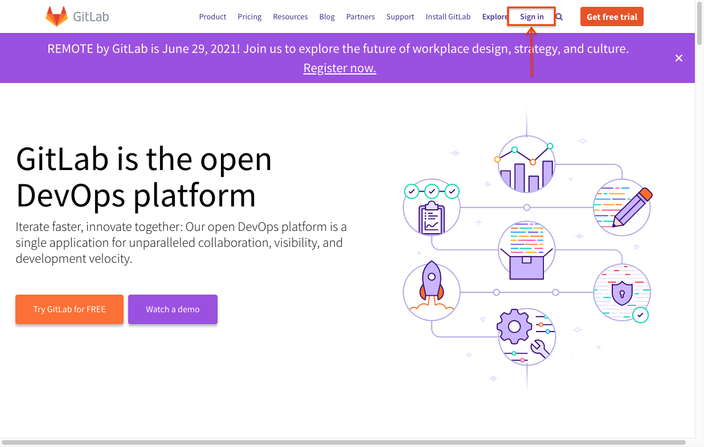

3. On the login page, click the "Register now" button to create an account (or sign in if you already have a personal GitLab account).

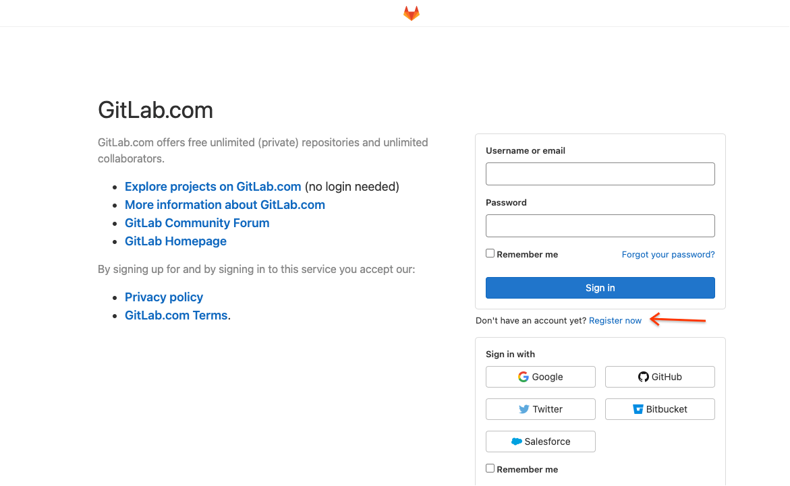

Since you'll be using this account after the completion of this course, use a personal email address, *not* your google.com account to register.
4. Once you've registered and logged in, click your profile picture and then the  [Preferences](https://gitlab.com/-/profile/preferences) button.

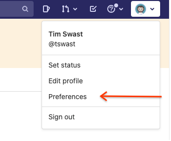
5. Select the  [SSH Keys](https://gitlab.com/-/profile/keys) item in the left navigation pane.

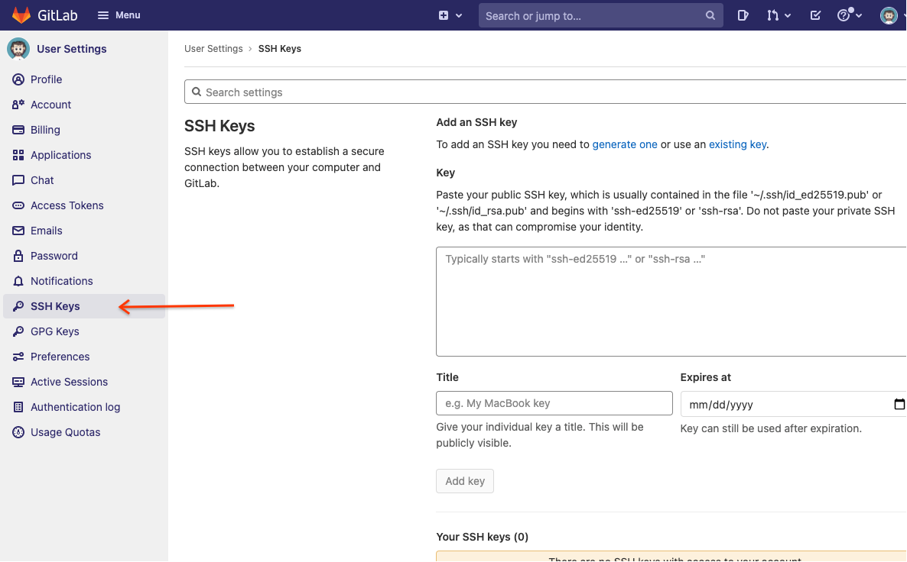

6. In a separate tab or window, open Cloud Shell from the  [Google Cloud Console](https://console.cloud.google.com/).
7. (In Cloud Shell) Display the SSH key you have been using for this course and copy the output.

```console
cat "$HOME/.ssh/id_ed25519.pub"
```

8. (In GitLab) Paste the contents of the SSH key you just copied.
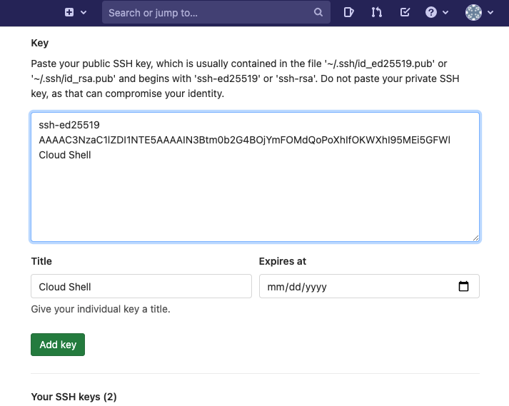
9. Click the "Add key" button.


## Create a GitLab project


Now that your GitLab account is configured, create a project to host your wiki repository.

> aside positive
> Each student should complete these steps. 

1. First, click the ➕ button. Next, navigate to the "New project" page.

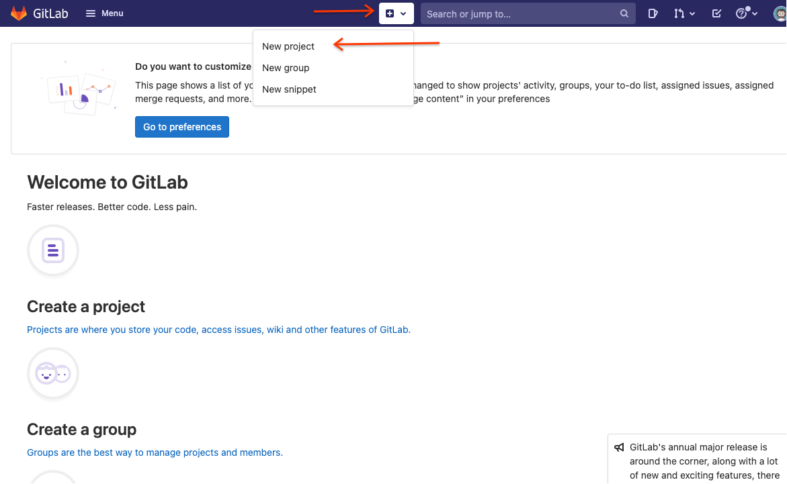

2. Select the "Create blank project" option in the new project page.

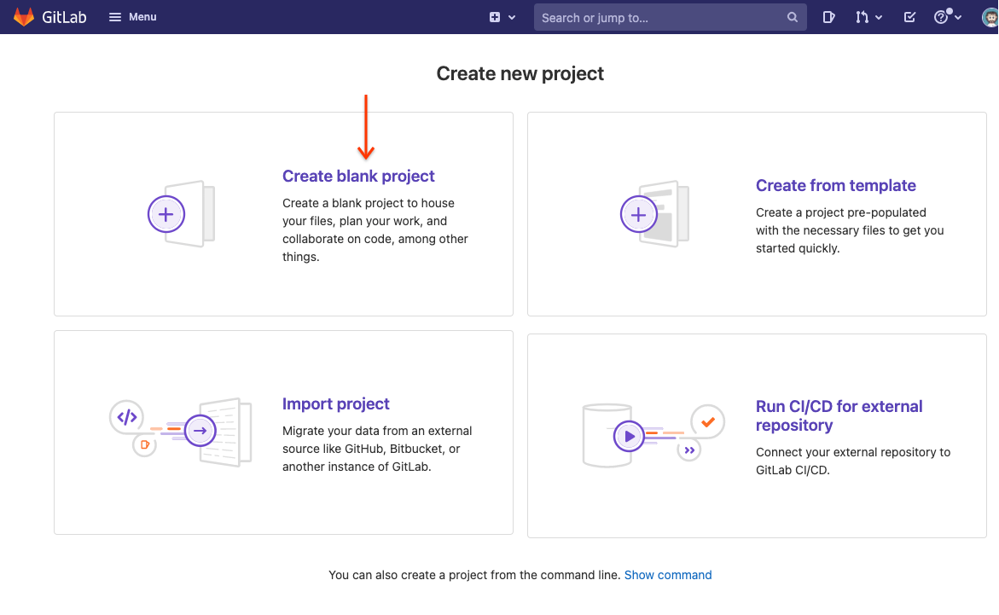
3. Give your project a name such as "wiki".

Set the visibility level to "public" so that you'll be able to send links to your project.

Do *not* check the "initialize repository" option.

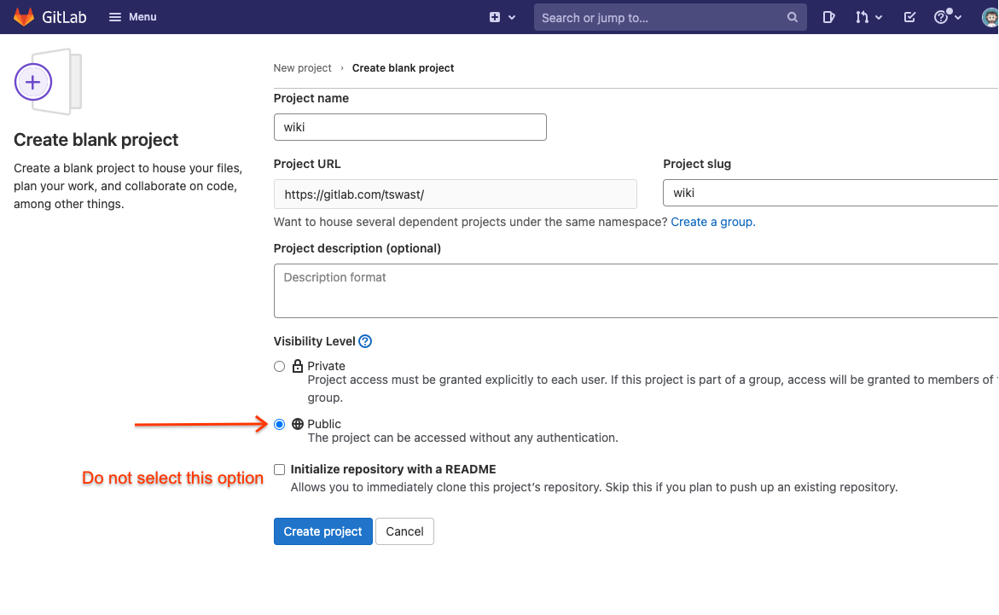
4. Click the "Create project" button.


## Push your code to GitLab


Until now, you've only been pushing to a single repository, referenced by the name "origin" in the Git command-line. Git can be used to reference multiple repositories, called "remotes".

> aside positive
> Each student should complete these steps. 

1. Before you continue, make sure that you have synced your Cloud Shell wiki repository with the latest version from your group's GitLab repository.

Run the usual set of Git commands to from your wiki repository directory:

```console
git checkout main

git fetch origin main

git merge origin/main
```

2. List all the repositories you can currently fetch from and push to.

```console
git remote -v
```


You should see "origin" listed twice: once for fetch and once for push.

3. In a separate tab, navigate to the project you just created in GitLab.

It should look like this:

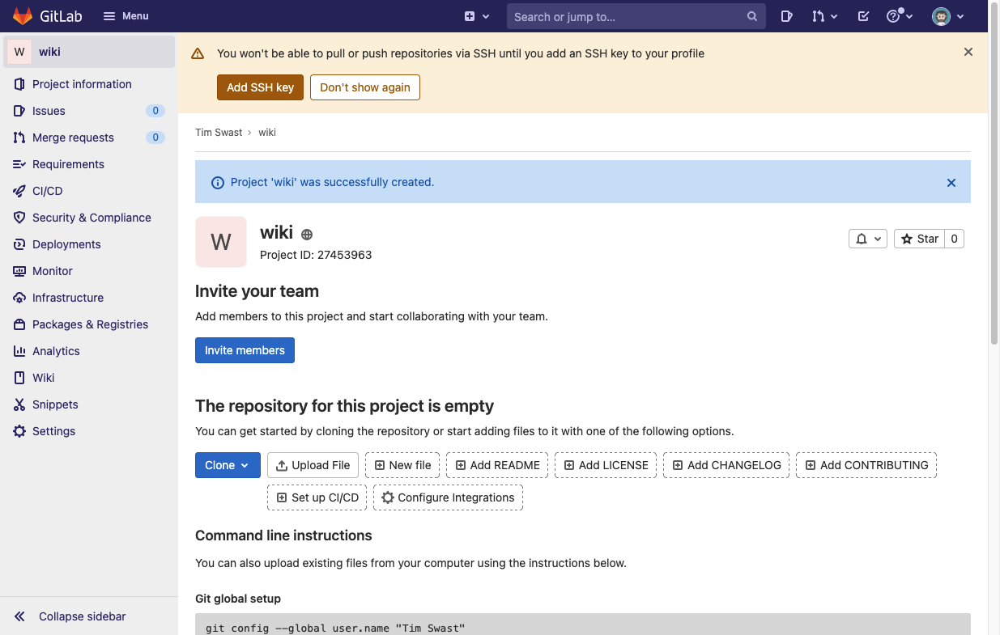

To get there from the main GitLab page, navigate to your projects.

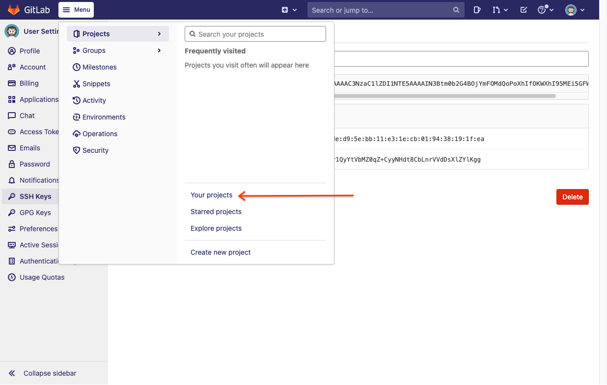

Then, click the name of the wiki project you recently created.

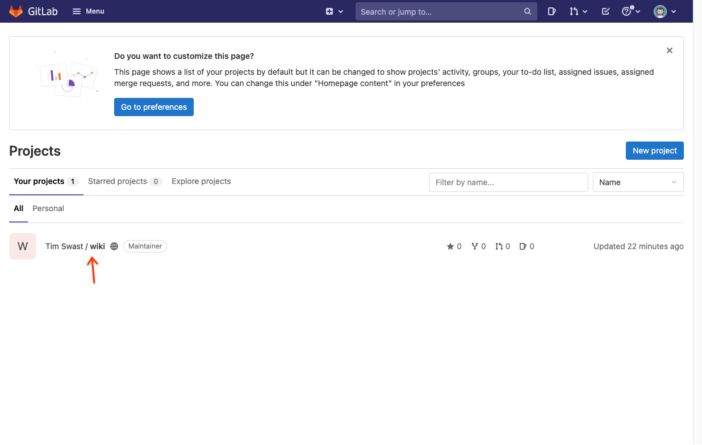
4. Click the Clone button and copy the "Clone with SSH" URL.

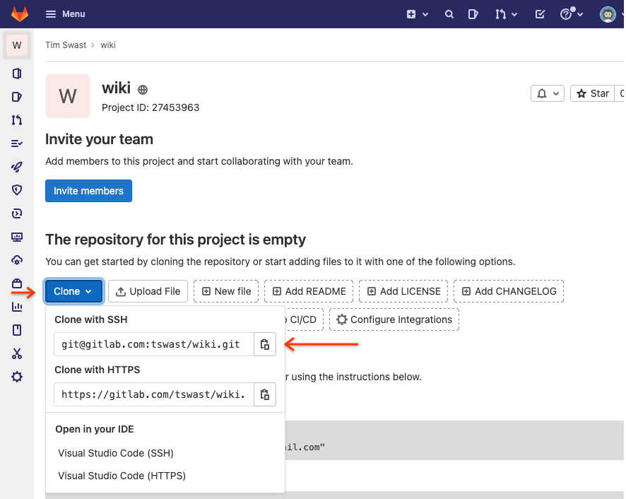

5. In Cloud Shell, create an new "remote" called "public" pointing at this repository.

        Replace `git@gitlab.com:tswast/wiki.git` with the URL you just copied.

```console
git remote add public git@gitlab.com:tswast/wiki.git
```

6. Check that the remote was created correctly.


```console
git remote -v
```

You should see both "origin" and "public" listed twice.

7. Push your main branch to this remote.

```console
git push public main
```


## Finishing up


Check that your wiki code was uploaded. You should see your README and source code. To double-check that the wiki is visible publicly, try to view it from an incognito window.

Congratulations, you've just published your wiki project!

### Next steps

* Add your wiki project to your resume. See the  [example resume blurb](https://docs.google.com/document/u/0/d/1TC7louBdToGuh-X8t71Xf_DoGrYKnUbhF9pduTMG3nY/edit?resourcekey=0-2Fjuhyo3YHg0zxI2zdhHqQ) for inspiration.
* This codelab may be followed for any repositories from in-class activities or homework for your own future reference. Out of respect for future students, we request that you keep the activity / homework repositories private in the GitLab settings.

### Project ideas

No software project is 100% complete. There are always things that could be nice to add. You may want to try continuing development of this project outside of class. If so, here are some ideas on next things to try.

* Run your project outside of Cloud Shell by installing Python and Git on your personal computer.
* Implement authentication. To avoid adding a database component, you may consider  [Firebase Authentication](https://firebase.google.com/docs/auth/web/start).
* Deploy your project by exploring the options suggested in the  [Flask documentation](https://flask.palletsprojects.com/en/2.0.x/deploying/index.html).
* Or use your software engineering skills to build something new!


